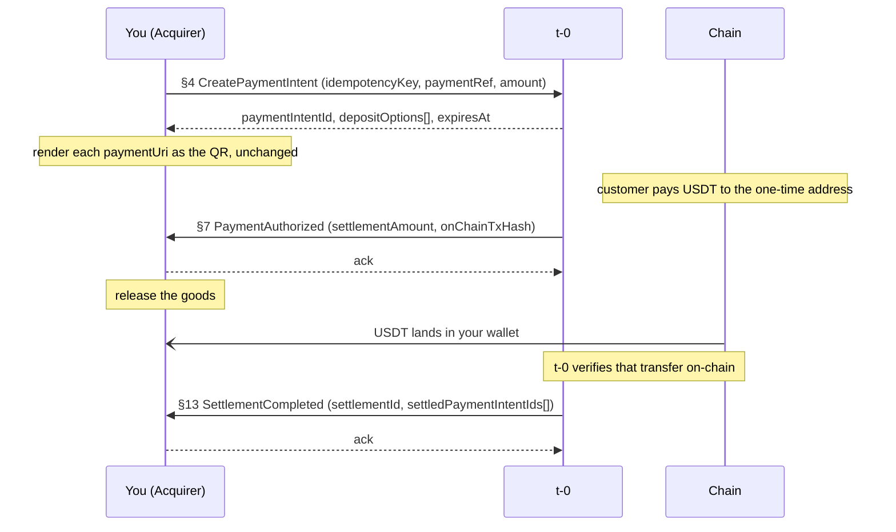
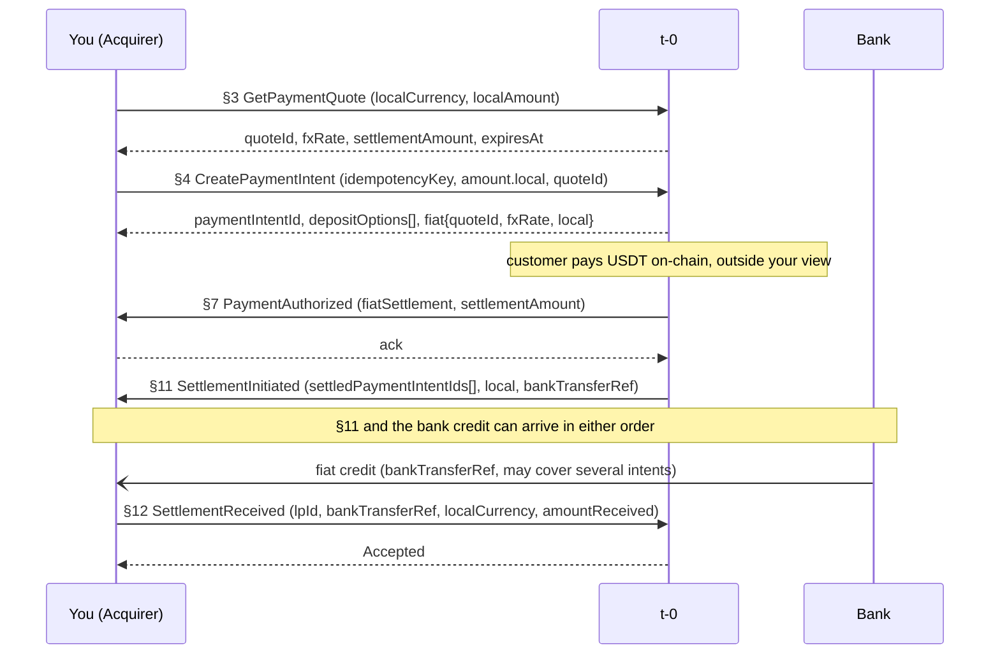

You create payment intents and render the QR for the customer. You receive settlement once the payment clears. You exchange no direct calls with the Issuer or the LP. In USDt mode, USDT lands in your wallet on-chain. In fiat mode, local currency lands in your bank account through the LP. You do not observe the customer's deposit: the Issuer watches the chain and reports to t-0, and t-0 tells you the outcome.

A sale is authorized after `§7` and settled after `§12` (fiat mode) or `§13` (USDt mode).

For client stubs and starter code, see the [USDT Pay SDK](https://github.com/t-0-network/usdt-pay-sdk). The protocol, shared identifiers, and endpoint map live in [How It Works](/docs/payments/how-it-works/).

## Before you start

1. Exchange your secp256k1 public key with t-0 at onboarding and receive t-0's.
2. Set the sandbox or production endpoint from the same exchange.
3. Expose a callback URL t-0 can reach.
4. Handle every amount as `Decimal{unscaled, exponent}` with decimal-safe arithmetic.

## What you host and what you call

| Direction | Endpoint | Mode | Idempotency key | API reference |
|---|---|---|---|---|
| You call | `§3 GetPaymentQuote` | fiat | — | [GetPaymentQuoteRequest](/docs/integration-guidance/api-reference/pay_acquirer/#tzero-v1-pay-acquirer-GetPaymentQuoteRequest) |
| You call | `§4 CreatePaymentIntent` | both | `idempotencyKey` | [CreatePaymentIntentRequest](/docs/integration-guidance/api-reference/pay_acquirer/#tzero-v1-pay-acquirer-CreatePaymentIntentRequest) |
| You call | `§12 SettlementReceived` | fiat | `(lpId, bankTransferRef)` | [SettlementReceivedRequest](/docs/integration-guidance/api-reference/pay_acquirer/#tzero-v1-pay-acquirer-SettlementReceivedRequest) |
| You host | `§7 PaymentAuthorized` | both | `paymentIntentId` | [PaymentAuthorizedRequest](/docs/integration-guidance/api-reference/pay_acquirer/#tzero-v1-pay-acquirer-PaymentAuthorizedRequest) |
| You host | `§11 SettlementInitiated` | fiat | `fiatSettlementId` | [SettlementInitiatedRequest](/docs/integration-guidance/api-reference/pay_acquirer/#tzero-v1-pay-acquirer-SettlementInitiatedRequest) |
| You host | `§13 SettlementCompleted` | USDt | `settlementId` | [SettlementCompletedRequest](/docs/integration-guidance/api-reference/pay_acquirer/#tzero-v1-pay-acquirer-SettlementCompletedRequest) |
| You host | `§15 PaymentExpired` | both | `paymentIntentId` | [PaymentExpiredRequest](/docs/integration-guidance/api-reference/pay_acquirer/#tzero-v1-pay-acquirer-PaymentExpiredRequest) |
| You host | `§16 PaymentFailed` | both | `paymentIntentId` | [PaymentFailedRequest](/docs/integration-guidance/api-reference/pay_acquirer/#tzero-v1-pay-acquirer-PaymentFailedRequest) |

`§7`, `§15`, and `§16` share `paymentIntentId` as their idempotency key. Dedup on the callback type, not on the key alone.

## Flow from your side

Solid arrows are API calls and their responses. Dotted open arrows are on-chain or bank transfers. Yellow notes mark things that happen outside your systems or that you do locally.

### USDt mode

The Issuer's settlement transfer may batch several intents into one on-chain transaction. `§13` names the intents each transfer covers.

### Fiat mode

In fiat mode there is no `§13`. Your `§12` is the terminal event. `§11` names the LP (`lpId`) and the `bankTransferRef` to expect on your statement.

## When the sale does not complete

**The QR window passes with no valid payment.** t-0 sends `§15 PaymentExpired` with `expiredAt` set to the intent's `expiresAt`. Cancel the sale and drop the QR.

**The Issuer will not process the deposit.** t-0 sends `§16 PaymentFailed` with the amount the Issuer reported and a `disposition` you relay to the customer. t-0 sends `§16` only for a deposit it processed before `expiresAt`. After expiry, `§15` is the last word.

**t-0 declines `§4`.** A declined `§4` never opens an intent. Nothing follows, and no callback arrives.

**`§16` delivery timing.** `§16` can arrive after `expiresAt` because delivery lags t-0's decision. Accept it if the intent is still open on your side.

## What t-0 checks on your calls

The [API reference](/docs/integration-guidance/api-reference/pay_acquirer/) lists the current reason codes for each endpoint. This section describes the behavior and your recovery path.

### `§3 GetPaymentQuote`

t-0 declines the quote request if no LP is assigned to you, if the LP has no standing quote in that currency, or if the amount violates the currency's decimal rules. Wait for the LP to publish a quote, or fix the amount and retry.

### `§4 CreatePaymentIntent`

t-0 rejects the call outright if your onboarding configuration does not match the request (fiat fields on a USDt-mode Acquirer, or no Issuer or LP configured). Fix your request or check your configuration.

Business declines fall into two groups:

**Quote-side declines** (the quote expired, no quote covers this currency, or the quote does not outlive the QR window): t-0 stored nothing. Call `§3` for a fresh quote and resend `§4`. The same key or a fresh one both work.

**Issuer-leg declines** (the Issuer will not handle this amount, has no addresses, or did not respond): the same key may re-drive the Issuer call if t-0 did not store an outcome, or replay the stored decline if it did. Send the same key once more. If the same decline comes back, the outcome is stored and you open a fresh key under the same `paymentRef`. For an amount the Issuer rejected, fix the amount and use a fresh key.

### `§12 SettlementReceived`

t-0 rejects `§12` if no `§11` exists for that `(lpId, bankTransferRef)` addressed to you, or if the currency or amount you sent differs from the `§11` figure. A rejection never consumes the pair. Resubmit with corrected fields. A repeat of an accepted `§12` is accepted regardless of content.

## What you must guarantee (t-0 does not check it)

- Write durably before acknowledging any callback. t-0 redelivers until it gets a success response, with no cap, and can redeliver once more after a success it failed to record.
- Dedup even after you acknowledged. Callbacks can arrive in any order, so a settlement callback before `§7` must not be dropped.
- Mint `idempotencyKey` when the sale is created, not at call time. Follow the `§4` retry rule above.
- Render `paymentUri` unchanged. The QR carries the Issuer's chain-native URI into the customer's wallet.
- Honour the absolute `expiresAt` t-0 returns. The window started before t-0 called the Issuer, so by the time you see it, part of the window has passed.
- Treat `§7` as authorization even though the customer's deposit is not yet final for you.
- Accept `§16` after `expiresAt` because delivery can lag t-0's decision.
- In fiat mode, match bank credits on `(lpId, bankTransferRef)` and confirm the exact `§11` figure in your `§12`.
- `§13` follows t-0's on-chain verification, not the Issuer's report. USDT can sit in your wallet before `§13` arrives.
- `§4` blocks while t-0 asks the Issuer. Size that call's timeout for a round trip through t-0.
- `acquirerId` on `§11`/`§13` is yours to check if you want. The contract no longer requires refusal.

## Reconcile against t-0

In USDt mode, watch your wallet for USDT credits and match each transaction against the `onChainTxHash` and `settledPaymentIntentIds[]` on `§13`. In fiat mode, match each bank credit against the `(lpId, bankTransferRef)` on `§11` and confirm it with `§12`. t-0 is your single source of truth for intent state: reconcile against `§7`, `§11`/`§13`, `§15`, and `§16`, not against the Issuer or the LP.

## Checklist

1. Persist `idempotencyKey` and `paymentRef` at sale creation.
2. Call `§4` once per key. On an Issuer-leg decline, retry the same key once before opening a fresh one.
3. Render `paymentUri` unchanged in the QR.
4. Host the five callbacks (`§7`, `§11`, `§13`, `§15`, `§16`) over the signed transport.
5. Write durably, then acknowledge.
6. Dedup each callback by `(callback type, idempotency key)`.
7. On `§7`, release goods. On `§15` or `§16`, cancel the sale.
8. Fiat: call `§3` before `§4`, match bank credits on `(lpId, bankTransferRef)`, send `§12` with the exact `§11` figure.
9. USDt: reconcile wallet credits against `§13`.
10. Size your `§4` timeout for a round trip through t-0 to the Issuer.
