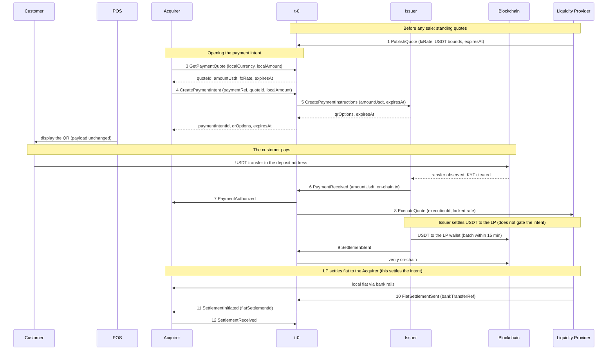

This document specifies the fiat settlement path: the path on which a merchant's Acquirer is settled in its local currency through a Liquidity Provider, while the customer pays USDT on-chain. It covers the inter-party protocol, the money movements, the settlement guarantee, and the failure handling. It is written for leaders, product managers, and architects across the four participants (t-0, the Acquirer, the Issuer, and the LP). The alternative mode, in which the Acquirer is settled in USDT on-chain, is out of scope here except for a single contrast that clarifies the boundary.

Throughout, message identifiers (for example `7 PaymentAuthorized`) are the names and numbers used in [How It Works](/docs/payments/how-it-works/).

---

## 1. What the fiat path is

The fiat settlement path is the configuration in which an Acquirer is settled in its merchants' local currency rather than in USDT. The customer always pays in USDT on-chain; the path differs only in how the Acquirer receives value. Settlement mode is fixed per Acquirer at onboarding by whether the Acquirer is associated with a Liquidity Provider: an Acquirer with an associated LP is settled in fiat through that LP, an Acquirer without one is settled in USDT on-chain. Each fiat Acquirer is served by exactly one LP, fixed at onboarding.

The Issuer always settles in USDT. In the fiat path the USDT it settles does not go to the Acquirer; it goes to the LP, and the LP delivers local fiat to the Acquirer over bank rails. The fiat path therefore has two settlement legs:

- The Issuer settles USDT to the LP (`9 SettlementSent`).
- The LP settles local fiat to the Acquirer (`10 FiatSettlementSent`, `11 SettlementInitiated`, `12 SettlementReceived`).

In the normal order these run in that sequence: the Issuer's USDT reaches the LP, then the LP pays the Acquirer. The contract does not make the Acquirer's settlement depend on the Issuer's USDT, however. The intent reaches its settled state on the Acquirer's confirmation of fiat receipt (`12`) alone, independent of the Issuer's USDT settlement (`9`). That independence is what lets the LP, when it chooses, deliver fiat to the Acquirer before the Issuer's USDT has arrived. That case, the LP fronting the fiat, is the exception, not the normal sequence; the same rule handles it.

For contrast, in the USDT path the Issuer settles USDT directly to the Acquirer's wallet and that single leg is the settlement; there is no LP and no fiat leg. Everything below concerns the fiat path.

---

## 2. Participants

| Participant | Role in the fiat path |
|---|---|
| **Customer** | Pays USDT on-chain from a non-custodial wallet to the one-time deposit address shown in the QR. |
| **Merchant** | Prices the sale in local currency and accepts payment through its Acquirer. Carries no protocol role beyond starting the sale. |
| **POS** | Renders the QR. Encodes the Issuer's payload without modification and talks only to the Acquirer. |
| **Acquirer** | Owns the merchant relationship. Requests a quote, opens the payment intent, relays authorization to the merchant, and confirms to t-0 when the LP's fiat lands. Holds no USDT and runs no FX desk. |
| **t-0** | Routes messages between adjacent parties, owns the payment intent and its state, and is the source of truth for intent state and on-chain settlement verification. Maintains the book of the LP's standing quotes and answers the Acquirer's quote requests from it. Holds no funds. |
| **Issuer** | Allocates the one-time deposit addresses, produces the QR payloads, watches the blockchain, screens the customer (KYT), recognizes and authorizes the payment, and settles in USDT on-chain. In the fiat path its USDT settles to the LP's wallet. Remains the obligor for every authorized sale. |
| **Liquidity Provider (LP)** | Publishes standing FX quotes into t-0's book and withdraws them as needed. On each authorized fiat sale it is bound to the quote's locked rate, delivers the local fiat to the Acquirer over bank rails, and reports it to t-0. It is the Acquirer's payer, not its obligor. |

Messages travel only between adjacent parties: POS to Acquirer, Acquirer to t-0, t-0 to Issuer, and t-0 to LP. The Acquirer never talks to the Issuer or the LP directly. The customer's USDT transfer to the deposit address and the LP's fiat transfer to the Acquirer are real money movements, on-chain and over bank rails respectively, not protocol messages.

---

## 3. End-to-end flow

The diagram traces one fiat sale from quote to settlement, in the normal order. The numbers are the contract's message identifiers. A worked example runs alongside the prose: an 80,000 COP sale priced from a standing quote at 4,000 COP per USDT.

### Standing quotes (`1 PublishQuote`, `2 WithdrawQuote`)

The LP publishes standing FX quotes into t-0's book on its own initiative, each a locked `fxRate` (units of local currency per 1 USDT) with per-sale USDT bounds and a validity window. A standing quote is immutable and reusable: any number of sales may price against it while it stands. The LP refreshes pricing by publishing new quotes and may withdraw a quote (`2 WithdrawQuote`) before it expires. A currency the LP is not currently quoting is unavailable, since each Acquirer's quotes come from its single LP. In the worked example the LP's quote prices COP at 4,000 COP per USDT.

### Opening the payment intent (`3`, `4`, `5`)

**`3 GetPaymentQuote`.** Before a sale the Acquirer asks t-0 for a quote, passing the local currency and the local amount. t-0 answers from the book with a `quoteId`, the indicative `amountUsdt`, the `fxRate`, and the quote's expiry, with no per-sale interaction with the LP. For the 80,000 COP sale, t-0 returns 20.00 USDT at 4,000 COP per USDT.

**`4 CreatePaymentIntent`.** The Acquirer opens the payment intent, passing its own `paymentRef`, the `quoteId`, and the sale's `localAmount`. The sale is denominated in local fiat: the Acquirer never sends a USDT figure. t-0 reads the currency and rate from the quote and derives the USDT the customer will pay as `amountUsdt = round(localAmount / fxRate)`, to two decimal places, half-up. Accepting the intent locks that rate for this intent; a later change or withdrawal of the quote does not affect it. t-0 declines the intent if the quote no longer stands, or if the quote's remaining validity is too short to guarantee the rate can be locked with the LP at authorization. For the worked example, `amountUsdt = round(80,000 / 4,000) = 20.00 USDT`.

**`5 CreatePaymentInstructions`.** Inline, t-0 asks the Issuer to prepare the payment, passing the `amountUsdt` and an absolute expiry (a 60 to 120 second window on t-0's clock). The Issuer reserves a one-time deposit address per supported chain, builds the chain-native QR payload for each, and returns them with the expiry. A one-time address per intent means every incoming transfer maps to exactly one sale. t-0 returns the `paymentIntentId`, the QR options, and the expiry to the Acquirer; the POS encodes the Issuer's payload without modification and displays it.

### The customer pays (`6`, `7`, `8`)

**The customer pays.** The customer scans the QR and transfers exactly the quoted USDT (20.00 USDT) on-chain to the deposit address. The Issuer observes the transfer, completes KYT screening, and recognizes the payment. It may recognize a valid payment before full on-chain confirmation, accepting the on-chain risk from that point.

**`6 PaymentReceived` and `7 PaymentAuthorized`.** The Issuer reports the payment to t-0 (`6`); t-0 requires the credited amount to equal the intent's `amountUsdt` exactly. t-0 then sends `7 PaymentAuthorized` to the Acquirer, which tells the merchant the sale is approved and releases the goods. From the moment t-0 transmits authorization, the Issuer is obligated to settle the sale.

**`8 ExecuteQuote`.** At authorization t-0 also binds the LP to the locked rate for this sale through `8 ExecuteQuote`, minting a per-sale `executionId`. This step exists because the quote's validity (about 5 minutes) is shorter than the settlement batch cadence (within 15 minutes): executing the quote converts the locked rate into a firm LP obligation that survives until settlement runs, even if the LP withdraws the quote in the meantime. The LP cannot decline; it pre-committed by publishing the quote.

### Settlement, in the normal order (`9`, then `10` to `12`)

**`9 SettlementSent` (Issuer to LP).** On its settlement batch, within about 15 minutes of authorization, the Issuer sends USDT on-chain to the LP's registered wallet and reports it through `9 SettlementSent`. t-0 verifies the transfer on-chain against the registered wallet and amount. This leg settles the Issuer's USDT obligation to the LP for the executions it covers. It is tracked separately from the intent and never changes the intent's state. A single `9` may cover executions for several Acquirers the LP serves. In the worked example the Issuer sends 20.00 USDT.

**`10`, `11`, `12` (LP to Acquirer).** Bound by the execution, the LP delivers the local fiat to the Acquirer over bank rails and reports it through `10 FiatSettlementSent`, naming its `bankTransferRef` and the executions it covers. t-0 validates the report against the executions it created at `8` (a single Acquirer, matching currency, an amount equal to the sum of the covered executions' local amounts, and the Acquirer's registered bank destination), mints a `fiatSettlementId`, and pre-notifies the Acquirer through `11 SettlementInitiated`, naming the LP, the bank transfer reference to expect, and the list of payment intents the transfer clears — one in this worked example, several when the LP batches multiple authorized sales into a single transfer — which the Acquirer maps to its own `paymentRef`s to split the one bank credit back into individual sales. Because a bank transfer cannot be verified on-chain, the intent reaches its settled state only when the Acquirer confirms the funds landed, through `12 SettlementReceived` with the matching amount. The Acquirer's `12` is the terminal event of the fiat path; there is no `13 SettlementCompleted` in the fiat path (that message belongs to the USDT path). For the worked example the LP delivers 80,000 COP and the Acquirer confirms 80,000 COP.

**Ordering.** The two legs are independent. In the normal order, as above, the Issuer's USDT reaches the LP (`9`) before the LP pays the Acquirer (`10` to `12`). Because the intent's settlement depends only on the Acquirer's confirmation (`12`) and not on the Issuer's USDT (`9`), the LP may also pay the Acquirer before the Issuer's USDT arrives. That fronting case is the exception, and the same rule (settle on `12`, independent of `9`) resolves it without special handling.

### Worked figures

| Quantity | Value | Where it is set or checked |
|---|---|---|
| `localAmount` | 80,000 COP | the merchant's bill, passed on `4` |
| `fxRate` | 4,000 COP per 1 USDT | locked from the standing quote at `4` |
| `amountUsdt` | 20.00 USDT | t-0 derives `round(80,000 / 4,000)` at `4` |
| Customer payment | 20.00 USDT | exactly `amountUsdt`, on-chain; `6` enforces equality |
| LP to Acquirer | 80,000 COP | the fiat leg; reported on `10`, confirmed on `12` |
| Issuer to LP | 20.00 USDT | the USDT leg; reported on `9`, verified on-chain |

### Intent lifecycle

t-0 tracks each intent through a small set of states, each marked by a message:

- **OPEN.** The intent is created (`4`) and the QR is live; no valid payment yet.
- **AWAITING_FIAT.** On authorization (`7`) the intent is authorized and, in the fiat path, awaits the LP's fiat; t-0 fires `8` at the same point.
- **SETTLED.** The Acquirer confirms fiat receipt (`12`). Terminal.
- **EXPIRED.** The QR window passes on t-0's clock with no valid payment. Terminal.

The Issuer's USDT settlement to the LP (`9`) is not one of these states and never moves the intent between them.

---

## 4. Money and liability model

**Denomination.** Local fiat is the unit of account. The merchant prices the sale in its own currency, and the Acquirer opens the intent on that local amount plus the quote reference; it never supplies a USDT figure. The quote's locked FX rate is the only conversion in play: t-0 applies it to derive the exact USDT the customer pays (`amountUsdt = round(localAmount / fxRate)`, two decimals, half-up), and the same rate fixes the USDT the Issuer later settles to the LP. The LP's obligation to the Acquirer is the local amount itself (the bill), not a rate-derived figure.

**Money movements.** Three transfers occur, in order:

1. The customer pays USDT once, on-chain, to the deposit address. This transfer is final and cannot be reversed.
2. The Issuer settles USDT to the LP's wallet (`9`), verified on-chain by t-0.
3. The LP delivers local fiat to the Acquirer over bank rails (`10` to `12`). The Acquirer's onward payout to the merchant is outside this specification.

**Liability.** For an authorized sale the responsibilities are fixed and asymmetric:

- The Issuer is the obligor of last resort. Once t-0 transmits `7 PaymentAuthorized`, the Issuer has accepted the payment and must settle it, and that obligation is never passed back to the Acquirer.
- A chain reorg on the customer's payment, a rejected settlement batch, or a stuck reconciliation is the Issuer's on-chain or operational matter to resolve. It is never surfaced to the Acquirer or merchant as a reversal. Once authorized, a sale is not reversed.
- The Issuer's obligation is identical in both settlement modes. Settling USDT to the Acquirer's wallet or to an LP are two delivery paths for the same debt.
- The LP is the Acquirer's payer, not its obligor. It delivers the local fiat and knows the Acquirer as a payee, resolving the bank account from the Acquirer's identifier, but the underlying liability stays with the Issuer.
- The Acquirer reconciles against t-0, the single source of truth for intent state and settlement verification, never against the LP. The Issuer and the LP likewise reconcile against t-0, not against each other.
- The Issuer's USDT settlement to the LP (`9`) is a separate obligation between those two parties. It never gates the intent, and the LP, not the Acquirer, carries the Issuer-default risk on any fiat it has delivered ahead of the Issuer's USDT (the fronting case).

t-0 holds no funds. It owns intent state, verifies on-chain settlement, validates the LP's fiat reports against the obligations locked at `8`, and treats the Acquirer's confirmation (`12`) as the sole oracle for the bank leg.

---

## 5. Failure handling

**The customer does not pay, or pays late.** If the QR window passes on t-0's clock with no valid payment, t-0 transitions the intent to EXPIRED and notifies the Acquirer (`15 PaymentExpired`), and the POS drops the QR. The Issuer confirms it released the deposit addresses (`14 PaymentExpired`). A transfer that lands after expiry is rejected by t-0 and refunded by the Issuer to the customer out of band. Nothing is owed.

**The LP is slow to deliver fiat.** If the LP has not reported its fiat transfer (`10`) within the configured window after authorization, t-0 escalates to the LP. The intent stays in AWAITING_FIAT; the Acquirer is still owed, and the Issuer remains the obligor behind it.

**The Acquirer has not confirmed receipt.** A sale settles only on the Acquirer's `12`. If `12` does not arrive within the configured window after `11`, t-0 escalates to the Acquirer for a person to investigate. The intent stays in AWAITING_FIAT, and the obligation is never passed back to the Acquirer.

**The Issuer is slow to settle the LP.** If the Issuer's USDT settlement to the LP (`9`) is late or fails to verify, t-0 escalates to the Issuer. This is an obligation between the Issuer and the LP; it never affects the intent, which settles on `12` regardless.

**A report fails validation.** If an inbound report (a payment, a USDT settlement, a fiat settlement, or a receipt confirmation) carries a figure that does not reconcile, for example a fiat total that does not match the executions it claims to cover, or a destination that is not the Acquirer's registered account, t-0 rejects it with a reason code. Because the underlying money movement already happened, the sender resubmits under the same reference with corrected fields; the correction replaces the rejected report and does not create a second payment. A genuinely different money movement is reported under a new reference and reconciled out of band.

Two protocol-wide controls underpin these:

**Idempotent retries.** Asynchronous messages are delivered at least once. Every state-changing message carries a designated key; a repeat with the same key returns the original result and causes no further effect. A customer is never charged twice, the Acquirer is never paid twice for one sale, and a retry is never taken for a new sale.

**Independent verification.** t-0 verifies the Issuer's USDT settlement (`9`) on the blockchain, against the registered wallet and amount. It validates the LP's fiat report (`10`) against the obligations it locked at `8`. It treats the Acquirer's confirmation (`12`), from the only party that sees the bank funds arrive, as the oracle for the fiat leg. No single party's report settles a sale on its own.

---

## 6. Responsibilities

| Party | Responsibilities in the fiat path |
|---|---|
| **Acquirer** | Request the quote, open the payment intent on the local amount, pass the QR to the POS unchanged, relay authorization to the merchant, and confirm to t-0 when the LP's fiat lands. Holds no USDT and runs no FX desk. |
| **t-0** | Own the payment intent and its state, route messages between adjacent parties, maintain the book of the LP's standing quotes and answer quote requests, lock each sale's rate at intent creation and bind the LP to it at authorization, verify on-chain settlement, validate the LP's fiat reports, and serve as the single reconciliation point. |
| **Issuer** | Allocate one-time deposit addresses and produce the QR payloads, watch the blockchain, run KYT, recognize and authorize valid payments, stand behind every authorized sale, and settle USDT on-chain to the LP's wallet. |
| **Liquidity Provider** | Publish and refresh standing FX quotes and withdraw them as needed, honor the locked rate on every executed sale, deliver the local fiat to the Acquirer over bank rails, and report each transfer to t-0. |

The merchant and the customer carry no protocol responsibilities. The merchant prices and starts the sale and waits for authorization; the customer scans and pays.

---

## 7. Glossary

**USDT.** The stablecoin the customer pays and the Issuer settles, pegged to the US dollar and transferred on-chain.

**Deposit address.** A one-time on-chain address the Issuer reserves for a single intent, so every transfer maps to exactly one sale.

**Standing quote.** An LP-published FX quote (a locked rate, per-sale USDT bounds, and a validity window) held in t-0's book and reusable by any number of sales while it stands.

**Rate lock.** Fixing a sale's FX rate when its intent is created (`4`), so later changes to the quote do not affect it.

**Execution.** The LP's firm per-sale obligation at the locked rate, created at authorization (`8`) and identified by an `executionId`.

**Authorization.** t-0's acceptance of the customer's payment (`7`), from which the Issuer is obligated to settle and the merchant can release goods.

**Settlement (fiat leg).** The local fiat reaching the Acquirer's bank account, confirmed by the Acquirer on `12`.

**Fronting.** The LP delivering the Acquirer's fiat before the Issuer's USDT settlement to the LP has arrived. The exception the independence rule handles without a special case.

**Reconciliation.** Each party checking its records against t-0, the single source of truth, rather than against each other.
