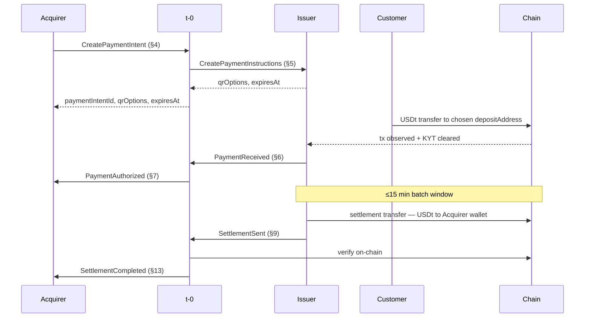
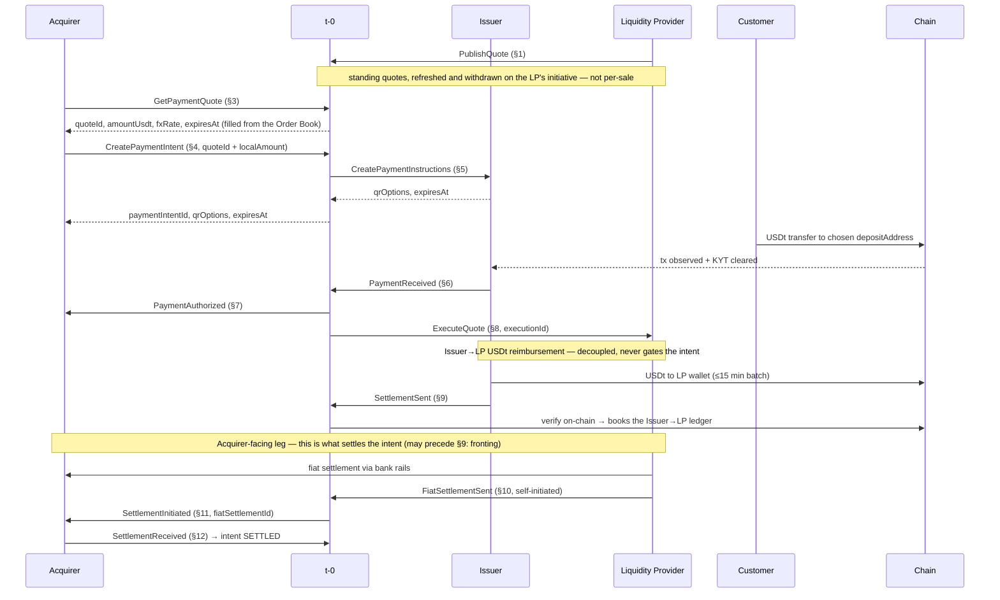
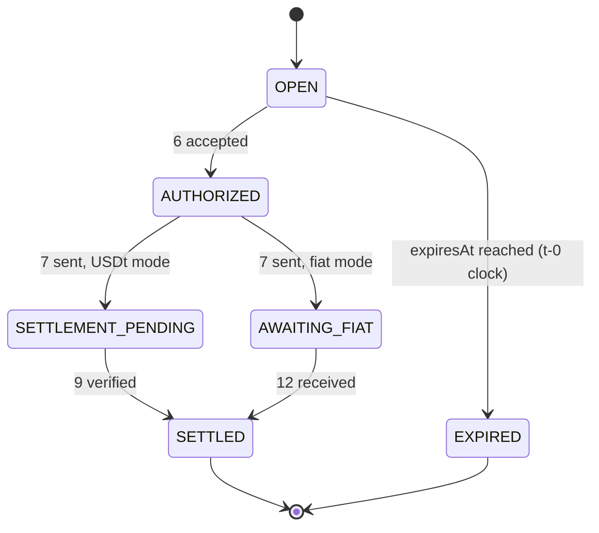

USDT Pay lets an Acquirer accept a customer's on-chain USDT payment and receive verified settlement in the mode configured at onboarding. The customer pays from their own wallet to a one-time deposit address. The Acquirer does not take custody of customer funds, and the QR only carries the chain-native payment URI into the wallet.

The flow starts when the Acquirer creates a payment intent. t-0 asks the Issuer for payment instructions, returns a deposit address and wallet payload, verifies the Issuer's payment report, authorizes the sale, and coordinates settlement. In USDT settlement, the Issuer settles on-chain to the Acquirer's wallet. In fiat settlement, the Issuer settles USDT to the LP, and the LP pays local fiat to the Acquirer over bank rails.

## Participants

- **Acquirer** — owns the merchant relationship; talks to the POS through its own internal API.
- **t-0 Network** — routes messages between the Acquirer and the Issuer, keeps the payment-intent ledger, maintains an **Order Book** of LP-pushed standing quotes (each Acquirer's quotes come from its single assigned LP) and answers USDt↔fiat quote requests from it, verifies settlement on-chain, and relays the Liquidity Provider's self-initiated fiat settlement to the Acquirer for confirmation when the Acquirer is configured for fiat settlement. Each Acquirer is mapped to exactly one Issuer at onboarding (and, for fiat settlement, to exactly one LP); t-0 routes `5` to that Issuer.
- **Issuer** — creates payment instructions, watches the blockchain for the customer's payment, and settles in USDt on-chain. At onboarding the Issuer configures an `acquirerId → settlementWallet` mapping per Acquirer it serves; the wallet may belong to the Acquirer (USDt mode) or to that Acquirer's single LP (fiat mode — each Acquirer is served by exactly one LP, fixed at onboarding). The Issuer identifies the Acquirer from the `acquirerId` carried on `5 CreatePaymentInstructions` and uses this mapping to determine the `destinationAddress` for `9 SettlementSent`. This resolution is deliberately independent of any t-0 instruction, so t-0's on-chain destination check on `9` is a genuine cross-check, not a confirmation of its own input.
- **Liquidity Provider (LP)** — in fiat-settlement mode, receives the Issuer's USDt and, on its own initiative, settles the locked fiat amount with the Acquirer over bank rails, reporting it to t-0 through `10 FiatSettlementSent`. Each Acquirer is served by exactly one LP, fixed at onboarding; that LP feeds t-0's Order Book on its own initiative: it pushes standing quotes (`1 PublishQuote`) and may withdraw them (`2 WithdrawQuote`); each standing quote belongs to the LP that published it. The Acquirer's LP is fixed for all fiat-mode steps of every intent (`8`, the settlement wallet, `10`); a referenced quote (`4`) selects the rate and currency for that intent, not the LP. Currency coverage is **not** pre-checked at onboarding: a local-fiat currency is serviceable only while the LP has a standing quote for it. Because that LP is the sole source of the Acquirer's quotes, a currency it is not currently quoting is declined at `3` (`QUOTE_UNAVAILABLE`), and the LP's quote liveness gates all of the Acquirer's fiat sales — a deliberate MVP simplification with no fallback LP. In the fiat leg the LP is the Acquirer's payer — it pays over bank rails and knows the Acquirer as a payee, resolving its bank account from `acquirerId` — but not its obligor: the Issuer stays liable and the Acquirer reconciles against t-0, never the LP.

The settlement mode — USDt on-chain or fiat — is fixed per Acquirer at onboarding by the **Acquirer↔LP association** (an associated LP ⇒ fiat, none ⇒ USDt); the Issuer always settles in USDt either way. There are no direct messages between non-adjacent parties: the POS only talks to the Acquirer, the Acquirer only to t-0, and t-0 talks to the Issuer and to the LP. Responses and asynchronous events travel the same chain in reverse. The LP settles fiat with the Acquirer over bank rails — a real-world payout, not an API message; the Acquirer never talks to the LP directly.

## End-to-end flow

The customer payment and authorization mechanics are the same in both settlement modes. The diagrams duplicate those steps intentionally so each mode can be read independently.

### USDt settlement

### Fiat settlement via LP

In fiat mode there is **no `13`**: the Acquirer's own `12 SettlementReceived` is the terminal event. `13 SettlementCompleted` is sent only in USDt mode (see below).

If the QR expires before the customer pays, t-0 — the expiry authority — transitions the intent to `EXPIRED` at `expiresAt` on its own clock and sends `15` to the Acquirer; the Issuer's `14` confirms it released the deposit addresses.

Once `7 PaymentAuthorized` has fired, the Issuer has accepted the payment and is obligated to settle it. A chain reorg on the customer's payment, a rejected settlement batch, or a stuck reconciliation is an on-chain or operational matter for the Issuer to resolve — never a reversal for the Acquirer or the merchant. The Issuer's obligation is unchanged whether funds reach the Acquirer as USDt on-chain or as fiat through an LP; the LP delivers the fiat, but the Issuer — not the LP — remains the Acquirer's obligor.

When the Acquirer is configured for fiat settlement (e.g., COP), the USDt↔fiat rate comes from t-0's **Order Book of standing quotes**. Each LP pushes quotes into the book on its own initiative through `1 PublishQuote` — a locked `fxRate` with per-sale amount bounds and a validity window — refreshes its pricing by publishing new quotes alongside earlier ones, and may withdraw a quote through `2 WithdrawQuote`. Before a sale, the Acquirer obtains a quote through `3 GetPaymentQuote`; t-0 answers from the book with no per-sale LP interaction. A standing quote is **multi-consumable**: the same `quoteId` may be returned to any number of quote requests and referenced by any number of payment intents while the quote stands. The Acquirer passes the `quoteId` together with the sale's `localAmount` into `4 CreatePaymentIntent`; acceptance locks the quote's rate for that intent, and the headroom rule on `4` guarantees the quote outlives the intent's QR window.

Fiat settlement runs as **two independent legs**. In the normal order the Issuer settles the LP first and the LP then settles the Acquirer, but the contract ties the intent to the Acquirer-facing leg alone, so neither order is required:

- **Issuer→LP reimbursement leg — decoupled; it never gates the intent.** The Issuer only ever sends USDt: at settlement it sends USDt on-chain to the **LP's** wallet (not the Acquirer's) and reports it through `9 SettlementSent`, which t-0 verifies on-chain and **books as an Issuer→LP obligation in its ledger**, settling the Issuer's USDt to the LP for the executions it covers. This is independent of the Acquirer's intent: if `9` is delayed or never verifies, the **Issuer simply stays owing the LP** in the ledger — the intent is unaffected, and the LP carries the Issuer-default risk on any fiat it has already delivered. One `9` to the shared LP wallet may cover executions across **several Acquirers** that LP serves (see §9).
- **Acquirer-facing leg — this is what settles the intent.** The quote's validity (≈5 min) is shorter than the settlement batch cadence, so the moment the payment is authorized t-0 executes the quote with the LP through `8 ExecuteQuote`, minting a per-sale **`executionId`** — bound 1:1 to the intent inside t-0 — that binds the LP to the locked rate before the quote can expire. On the obligations it took at `8`, the LP settles the locked fiat to the Acquirer over bank rails on its own initiative and reports it through `10 FiatSettlementSent`. t-0 maps the LP's `settledExecutionIds` to their intents, mints a **`fiatSettlementId`**, and pre-notifies the Acquirer through `11 SettlementInitiated`, naming the `bankTransferRef` to expect and the intents it clears. Because the bank-rails leg is not on-chain-verifiable, t-0 treats the intent as **`SETTLED` only once the Acquirer confirms receipt** through `12 SettlementReceived` with the matching amount. The Acquirer's `12` is the **terminal** event — there is **no `13`** in fiat mode. Because this leg does not depend on `9`, the LP may also settle the Acquirer **before** the Issuer's USDt arrives (fronting it on the `8` obligations plus its private funding arrangement with the Issuer); the independence rule resolves that corner case cleanly.

## Payment intent states (t-0 ledger)

The intent's lifecycle tracks **only the Acquirer-facing settlement**. In fiat mode the Issuer→LP `9 SettlementSent` is booked on a separate settlement record (the Issuer→LP reimbursement ledger) and **does not appear in this state machine** — it never moves the intent.

**OPEN** — intent created, payment instructions live, customer payment not yet observed.

**AUTHORIZED** — t-0 has accepted `6 PaymentReceived` and is transmitting `7 PaymentAuthorized`. On *transmit* of `7` (not on the Acquirer's acknowledgment, consistent with Obligation binding) the intent moves to `SETTLEMENT_PENDING` (USDt mode) or `AWAITING_FIAT` (fiat mode); in fiat mode t-0 also fires `8 ExecuteQuote` here.

**SETTLEMENT_PENDING** (USDt mode only) — t-0 is waiting for the Issuer's `9 SettlementSent` to the Acquirer's wallet. A verified `9` → `SETTLED`, then `13`.

**AWAITING_FIAT** (fiat mode only) — the LP owes the Acquirer fiat at the locked rate. t-0 awaits the LP's self-initiated `10 FiatSettlementSent`, relays it as `11 SettlementInitiated`, and closes the leg on the Acquirer's `12 SettlementReceived`. The intent → `SETTLED` when `12` arrives with the matching amount. The Issuer→LP `9` is independent and never enters here.

**SETTLED** — settlement reached the Acquirer (terminal). USDt mode: `9 SettlementSent` passed on-chain verification. Fiat mode: the Acquirer confirmed fiat receipt via `12` (the Issuer→LP `9` may still be outstanding — that is an Issuer↔LP ledger matter, not the intent's).

**EXPIRED** — reservation lapsed with no valid payment (terminal). Entered on t-0's clock at `expiresAt`; the Issuer's `14` is confirmation, not the trigger.

## Conventions

- **Data types used:** `string`, `number`, `amount` (decimal monetary), `timestamp` (absolute, UTC), `boolean`, `list of T`, `object { ... }`, `oneof { ... }` (tagged union — exactly one variant present; the variant key is the discriminator).
- **Amount derivation.** `amountUsdt` is derived only by t-0, at its single derivation point `4 CreatePaymentIntent` (and computed the same way as the indicative value on `3`): `amountUsdt = round(localAmount / fxRate, 2 dp, half-up)` — two decimal places, round-half-up. This holds in both settlement modes. The customer pays exactly this `amountUsdt`, and `6 PaymentReceived` requires strict equality against it.
- **Synchronous** endpoints return a response in the same call. **Asynchronous** endpoints are pushed events; the sender retries until the receiver acknowledges.
- **Obligation binding** — all obligations in this protocol attach at the moment t-0 *transmits* the relevant message. LP or Issuer acknowledgment timing does not affect when an obligation is created or takes effect.
- **Decline model** — only the synchronous endpoints (`1`–`5`) can decline in the same call, and each synchronous response is a `result` that is `oneof { success { … } | failure { reason } }` — the `failure` variant carries a canonical `reason` code (mirroring the proto; there is no separate `declined` boolean). Before payment is received, the Acquirer learns of failure through the expiry event (`15 PaymentExpired`). After `7 PaymentAuthorized` has fired the Issuer has accepted the payment and is obligated to settle it; any on-chain retry or reconciliation the Issuer performs (directly in USDt, or via an LP in fiat mode) is not exposed to the Acquirer.
- **Chain names** are a fixed canonical set maintained by t-0 — full, **case-sensitive** names, identical across every endpoint carrying a `chain` field. (The proto `BLOCKCHAIN_*` enum labels and the SQL `pay_blockchain` labels are internal representations mapped to these wire names.) **Live at launch:** `TRON`, `Ethereum`, `BSC`. **Announced as upcoming, not yet accepted:** `Polygon`, `Arbitrum`, `Optimism`, `Base`, `Avalanche`, `Solana` — the Issuer offers no `qrOptions` on these, so a customer cannot pay on them through the flow until they go live. Extensible as the upcoming chains are enabled.

Idempotency keys, retry identity, the accepted/rejected contract, and reliability timers are covered in [Idempotency and Reliability](/docs/integration-guidance/idempotency/).

## Shared identifiers

| Identifier | Minted by | Notes |
|---|---|---|
| `quoteRef` | LP | Idempotency key on `1` — the LP's identifier for one pushed standing quote; echoed as data on `8 ExecuteQuote`. Unique per LP. |
| `quoteId` | t-0 | t-0's identifier for one standing quote in its Order Book, minted on `1`. Returned by `3`; referenced by any number of `4`s while the quote stands; carried as data on `8`. Also the key the LP echoes on `2 WithdrawQuote`. Fiat-configured Acquirers only. |
| `paymentRef` | Acquirer | Idempotency key on `4`. Unique per Acquirer. |
| `paymentIntentId` | t-0 | Idempotency key on `5`, `6`, `7`, `14`, `15`. Not exposed to the LP — see `executionId`. |
| `executionId` | t-0 | t-0's identifier for one execution of a standing quote — minted at authorization, bound 1:1 to the authorized payment intent. The LP's idempotency key on `8` and its obligation handle; the unit the LP reports settlements in (`settledExecutionIds` on `10`). Not exposed to the Acquirer. Fiat mode only. |
| `settlementRef` | Issuer | Idempotency key on `9`. The Issuer's id for its own USDt settlement. Unique per Issuer. |
| `settlementId` | t-0 | t-0's id for one **on-chain USDt settlement** (`9`), minted at the verified `9`. USDt mode: the Issuer→Acquirer settlement and the idempotency key on `13`. Fiat mode: the Issuer→LP reimbursement record, booked to the Issuer↔LP ledger and **not surfaced to the Acquirer**. |
| `fiatSettlementId` | t-0 | t-0's id for one **bank-rails fiat settlement** (`10`/`11`/`12`), minted when t-0 accepts the LP's `10` (the `fiat_settlement` record); the idempotency key on `11`. Fiat mode only. |
| `bankTransferRef` | LP | LP-generated reference on the bank-rails transfer and the idempotency key on the LP's self-initiated `10`. t-0 relays it as data on `11` so the Acquirer knows which transfer to expect; the Acquirer reads it off its statement and echoes it on `12`, where the idempotency key is the pair (`lpId`, `bankTransferRef`); t-0 matches `10` ↔ `12` on that pair. Unique per LP only — `lpId` disambiguates across LPs. Fiat mode only. |
| `acquirerId` | t-0 | t-0's stable identifier for the Acquirer. Included in `5` so the Issuer can resolve its `acquirerId → settlementWallet` mapping, and in `8` so the LP can resolve the Acquirer's registered bank destination. |
| `lpId` | t-0 | t-0's stable identifier for the Liquidity Provider. Carried as data on `11` so the Acquirer knows which LP's transfer to expect; echoed on `12`, where it scopes `bankTransferRef` (the key is the pair). Fiat mode only. |

`11 SettlementInitiated` (fiat mode) is keyed on t-0's `fiatSettlementId`; `13 SettlementCompleted` (USDt mode only) is keyed on t-0's `settlementId`. Neither uses a foreign role's id as its key — the `lpId` and `bankTransferRef` carried on `11` ride as data, not as the key. In USDt mode the Acquirer correlates the settlement through `13`'s `settledPaymentIntentIds` and `onChainTxHash`; in fiat mode through `11`'s `fiatSettlementId` + `bankTransferRef`, which it confirms with its own `12`.

## Endpoint map

The flow numbers used above map to RPCs across the three role services. Request and response fields for each live in the generated API Reference.

| # | Endpoint | Hosted by | Called by | Reference |
|---|----------|-----------|-----------|-----------|
| 1 | PublishQuote | t-0 | LP | [Liquidity Provider](/docs/integration-guidance/api-reference/pay_lp/) |
| 2 | WithdrawQuote | t-0 | LP | [Liquidity Provider](/docs/integration-guidance/api-reference/pay_lp/) |
| 3 | GetPaymentQuote | t-0 | Acquirer | [Acquirer](/docs/integration-guidance/api-reference/pay_acquirer/) |
| 4 | CreatePaymentIntent | t-0 | Acquirer | [Acquirer](/docs/integration-guidance/api-reference/pay_acquirer/) |
| 5 | CreatePaymentInstructions | Issuer | t-0 | [Issuer](/docs/integration-guidance/api-reference/pay_issuer/) |
| 6 | PaymentReceived | t-0 | Issuer | [Issuer](/docs/integration-guidance/api-reference/pay_issuer/) |
| 7 | PaymentAuthorized | Acquirer | t-0 | [Acquirer](/docs/integration-guidance/api-reference/pay_acquirer/) |
| 8 | ExecuteQuote | LP | t-0 | [Liquidity Provider](/docs/integration-guidance/api-reference/pay_lp/) |
| 9 | SettlementSent | t-0 | Issuer | [Issuer](/docs/integration-guidance/api-reference/pay_issuer/) |
| 10 | FiatSettlementSent | t-0 | LP | [Liquidity Provider](/docs/integration-guidance/api-reference/pay_lp/) |
| 11 | SettlementInitiated | Acquirer | t-0 | [Acquirer](/docs/integration-guidance/api-reference/pay_acquirer/) |
| 12 | SettlementReceived | t-0 | Acquirer | [Acquirer](/docs/integration-guidance/api-reference/pay_acquirer/) |
| 13 | SettlementCompleted | Acquirer | t-0 | [Acquirer](/docs/integration-guidance/api-reference/pay_acquirer/) |
| 14 | PaymentExpired (Issuer → t-0) | t-0 | Issuer | [Issuer](/docs/integration-guidance/api-reference/pay_issuer/) |
| 15 | PaymentExpired (t-0 → Acquirer) | Acquirer | t-0 | [Acquirer](/docs/integration-guidance/api-reference/pay_acquirer/) |

## Out of scope (MVP)

Refunds, chargebacks, disputes, manual cancel/void, mispayment events (the Issuer's refund obligation for incorrect-amount payments is in scope per `6`), card channel, onboarding endpoints, query/status/report endpoints, bilateral credit-line management, Acquirer→merchant payout, the LP's internal pricing and risk mechanics and bank-rail mechanics, Acquirer-side quote amendment or cancellation (standing quotes are immutable; the LP refreshes by publishing new quotes and may withdraw — `1`, `2`), and the POS↔Acquirer API.
