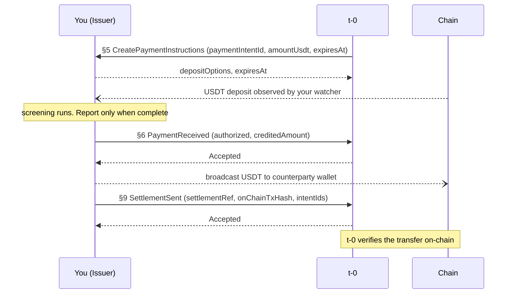

You are the only role that touches the chain in both directions. You reserve one-time deposit addresses, watch for the customer's USDT deposit, screen it, report the outcome to t-0, and broadcast the settlement transfer. You exchange no direct calls with the Acquirer or the LP. `§5 CreatePaymentInstructions` names the Acquirer by `acquirerId` and nothing more. A sale is authorized after `§7` and settled after `§12` (fiat mode) or `§13` (USDt mode). For stubs and starters, see the [USDT Pay SDK](https://github.com/t-0-network/usdt-pay-sdk).

## Before you start

1. Exchange your secp256k1 public key with t-0 at onboarding and receive t-0's.
2. Set the sandbox or production endpoint from the same exchange.
3. Expose a callback URL t-0 can reach.
4. Handle every amount as `Decimal{unscaled, exponent}` with decimal-safe arithmetic.

## What you host and what you call

| Direction | Endpoint | Mode | Key | API reference |
|---|---|---|---|---|
| Host | `§5 CreatePaymentInstructions` | Both | `paymentIntentId` | [CreatePaymentInstructionsRequest](/docs/integration-guidance/api-reference/pay_issuer/#tzero-v1-pay-issuer-CreatePaymentInstructionsRequest) |
| Call | `§6 PaymentReceived` | Both | `paymentIntentId` | [PaymentReceivedRequest](/docs/integration-guidance/api-reference/pay_issuer/#tzero-v1-pay-issuer-PaymentReceivedRequest) |
| Call | `§9 SettlementSent` | Both | `settlementRef` | [SettlementSentRequest](/docs/integration-guidance/api-reference/pay_issuer/#tzero-v1-pay-issuer-SettlementSentRequest) |

## Flow from your side

Solid arrows are API calls. Dashed arrows are responses. Dashed open arrows are on-chain or bank transfers. Yellow notes mark things that happen outside your systems or that you do locally.

### Reserve, observe, report, settle

**Counterparty wallet.** In USDt mode you send USDT to the Acquirer's wallet. In fiat mode you send USDT to the LP's wallet. Both come from your own `acquirerId`-to-wallet mapping, configured at onboarding. t-0 sends no wallet on `§5`, so its destination check on `§9` is a genuine cross-check against your mapping.

## When the sale does not complete

**Screening fails.** You send `§6 PaymentReceived` with an `unprocessable` outcome and a `disposition`. t-0 responds `Accepted`. If the disposition is to return the funds, you broadcast a refund to `senderAddress`. If the disposition is to retain them, no transfer follows.

**Deposit reported after the QR window.** t-0 judges expiry by the moment it starts processing your `§6`. A deposit that landed in time but that you reported after `expiresAt` is rejected as expired, the same as a late deposit. Refund it to `senderAddress`.

**Duplicate transaction hash.** If t-0 rejects `§6` because that on-chain transaction is recorded under a different intent, do not refund. Reconcile this case out of band.

**No deposit arrives.** Release the address on your own clock at `expiresAt`. No expiry callback exists for the Issuer.

**You decline `§5`.** Your decline response (no addresses available, amount out of range, or a general failure) ends the intent before the customer sees a QR.

## What t-0 checks on your calls

The [API reference](/docs/integration-guidance/api-reference/pay_issuer/) lists the current reason codes for each endpoint. This section describes the behavior and your recovery path.

### §5 CreatePaymentInstructions (your response)

t-0 validates your response before accepting it. You must return at least one deposit option with `chain` set, addresses between 34 and 42 characters, a non-empty `paymentUri`, and a `tokenContract`. Your `expiresAt` must be at or after the value t-0 requested; if it is earlier, t-0 discards the response and declines the payment. t-0 gives up on the call after a short deadline and declines the payment if you do not answer in time.

t-0 does not verify the token contract against a known USDT address, does not enforce one option per chain, and does not check the URI format.

### §6 PaymentReceived

t-0 rejects `§6` if the intent is not yours, if t-0 started processing after `expiresAt` on its clock (also returned for declined intents), if the intent is still being created (retry after a short wait), or if the same on-chain transaction hash is recorded under a different intent (do not refund that case; reconcile out of band).

For an `authorized` outcome, the credited amount you report must equal the intent's `settlementAmount` (`12.5` equals `12.50`). Report the amount that was credited, not the amount you expected. Replays must match: an authorized replay accepts only `authorized` again, and an unprocessable replay accepts only the same disposition.

Rejections do not consume the key. `§6` carries the amount, chain, transaction hash, and sender address. It carries no deposit address and no token contract. t-0 does not match the chain to an offered option or look the deposit up on-chain.

### §9 SettlementSent

t-0 checks `§9` in three stages.

**Replay.** If you resubmit a `settlementRef` that t-0 accepted before, identical content is accepted again. Different content is rejected; do not reuse that ref, send a corrected report under a fresh one.

**Validation of a new report.** t-0 checks in order: every intent id must be known, yours, and in an authorized or settled state; the destination must be one counterparty, one mode, and the counterparty's registered wallet; the sum of the intents' `settlementAmount` must equal your reported total. Fix your intent set, verify your `acquirerId`-to-wallet mapping, or report the exact aggregate.

**Insert-time conflicts.** t-0 rejects if the same on-chain transaction hash sits under another ref (use a fresh `settlementRef`) or if an intent is covered by a settlement another ref accepted (remove the covered intent).

One `§9` may cover many intents. In fiat mode it may cover several Acquirers that share the LP wallet. It must not mix USDt-mode and fiat-mode intents, and it must not mix two LPs. Each intent belongs to one accepted settlement and each transaction to one ref.

## What you must guarantee (t-0 does not check it)

- Return one reservation per `paymentIntentId`. On a repeat `§5` with the same id, return the same addresses.
- Use one-time addresses. Each deposit address maps to one intent.
- Honour the absolute `expiresAt` that t-0 sends. The QR window started before t-0 called you, so the time you see is shorter than a full window.
- Resolve the settlement wallet from `acquirerId` using your own onboarding mapping. t-0 sends no wallet on `§5`, so its `§9` check is a genuine cross-check.
- Verify the deposit yourself: check the token contract and deposit address against your reservation. `§6` carries no address or token, and t-0 checks none of those fields.
- Report only after screening is complete. Report before `expiresAt` or t-0 treats the deposit as late.
- From `Accepted` on `§6` you own the on-chain risk. Reorgs are yours.
- Write durably before acknowledging any callback. t-0 redelivers until it gets a success response, with no cap, and can redeliver once more after a success it failed to record.
- Dedup even after you acknowledged. Callbacks can arrive in any order.
- One `settlementRef` maps to one broadcast transfer. Do not broadcast a second transfer as a retry. A single intent can never split across transactions.
- After `Accepted` on `§9`, t-0 sends you no verdict. Keep your own confirmation tracking and expect t-0 to raise a mismatch with you out of band.

## Reconcile against t-0

You can watch the chain for your own settlement transfers and compare them against the `§9` reports you sent. t-0 verifies each transfer on-chain and stores a verdict, but sends you nothing after `§9`. Your `§9` report (the `settlementRef`, the intent set, and the on-chain transaction hash) is your record for each settlement. If your chain watcher and t-0's verdict disagree, t-0 raises the mismatch out of band.

## Checklist

1. Host `§5` over the signed transport and answer before t-0's deadline.
2. Return one reservation per `paymentIntentId`, same answer on a repeat.
3. Use one-time addresses per chain, each with `paymentUri` and `tokenContract`.
4. Hold your own `acquirerId`-to-wallet mapping.
5. Watch the chain for deposits. Verify the token contract and amount yourself.
6. Screen, then send `§6` with the credited amount.
7. On `Accepted` treat the settlement as owed.
8. Broadcast one transfer per `settlementRef` to the counterparty wallet.
9. Send `§9` with the exact aggregate and the full intent set.
10. Keep your own confirmation tracking.
11. Release addresses at `expiresAt`.
12. Refund late or unprocessable deposits to `senderAddress`.
