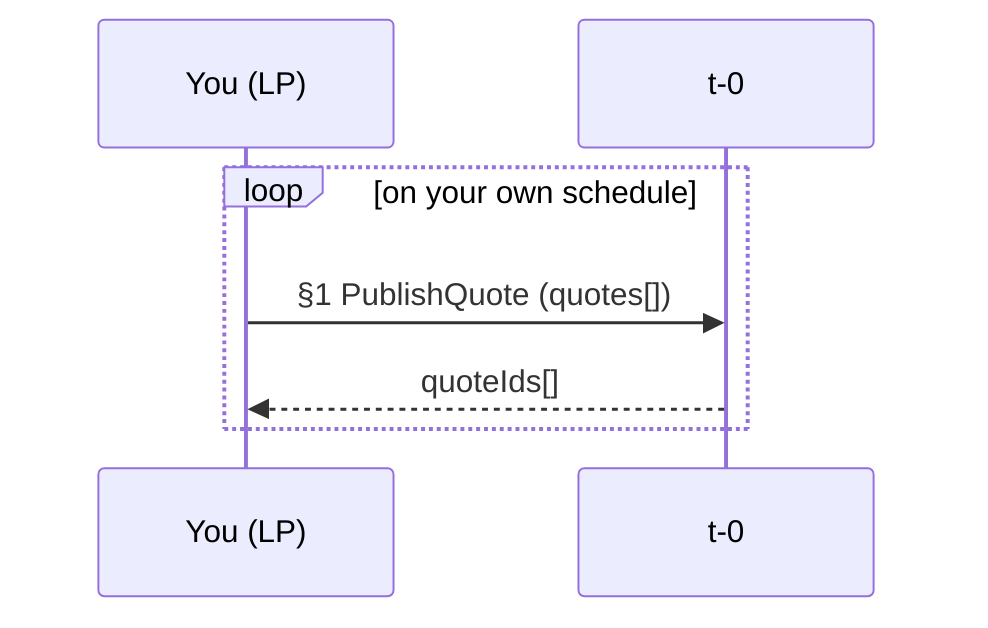
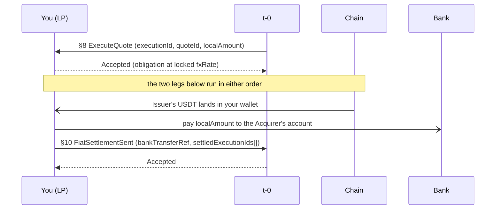

You exist in the protocol for fiat-mode Acquirers. You price foreign-exchange quotes and accept executions at the locked rate. You pay the Acquirer over bank rails. The Issuer's USDT reaches your wallet with no protocol message to announce it. The Acquirer's confirmation of your bank transfer stays between the Acquirer and t-0: you receive nothing after t-0 accepts your `§10`. You exchange no direct calls with the Acquirer or the Issuer. See the [usdt-pay-sdk](https://github.com/t-0-network/usdt-pay-sdk) repository for stubs and starters.

A sale is authorized after `§7` and settled after `§12` (fiat mode) or `§13` (USDt mode).

## Before you start

1. Exchange your secp256k1 public key with t-0 at onboarding and receive t-0's.
2. Set the sandbox or production endpoint from the same exchange.
3. Expose a callback URL t-0 can reach.
4. Handle every amount as `Decimal{unscaled, exponent}` with decimal-safe arithmetic.

## What you host and what you call

| Direction | Endpoint | Mode | Key | API reference |
|---|---|---|---|---|
| You call | `§1 PublishQuote` | fiat | `quoteRef` (per quote in the batch) | [PublishQuoteRequest](/docs/integration-guidance/api-reference/pay_lp/#tzero-v1-pay-lp-PublishQuoteRequest) |
| You call | `§10 FiatSettlementSent` | fiat | `bankTransferRef` | [FiatSettlementSentRequest](/docs/integration-guidance/api-reference/pay_lp/#tzero-v1-pay-lp-FiatSettlementSentRequest) |
| You host | `§8 ExecuteQuote` | fiat | `executionId` | [ExecuteQuoteRequest](/docs/integration-guidance/api-reference/pay_lp/#tzero-v1-pay-lp-ExecuteQuoteRequest) |

## Flow from your side

Solid arrows are API calls and their responses. Dotted open arrows are on-chain or bank transfers. Yellow notes mark things that happen outside your systems or that you do locally.

### Standing quotes

Each call carries at most one quote per currency. The batch is atomic: all quotes succeed or all fail. A currency you stop quoting becomes unavailable to your Acquirers at `§3`.

### One authorized sale

One Issuer transfer may cover executions for several Acquirers. One bank transfer credits one Acquirer and may batch several executions for that Acquirer. A `Rejected` answer on `§8` ends your part in that sale.

## When the sale does not complete

**You reject the execution.** You answer `§8` with `Rejected`. The intent stays authorized and moves to manual handling. You receive nothing further for it.

**The customer does not pay, or the deposit is refused.** No `§8` reaches you. The quote stands for the next sale.

**t-0 rejects your `§10`.** The bank transfer already happened. Resubmit the same `bankTransferRef` with corrected fields.

## What t-0 checks on your calls

The [API reference](/docs/integration-guidance/api-reference/pay_lp/) lists the current reason codes for each endpoint. This section describes the behavior and your recovery path.

### §1 PublishQuote

t-0 validates the whole batch before it looks up any `quoteRef`. It rejects the call if the batch contains a duplicate `quoteRef` or duplicate currency, if any `fxRate` is outside t-0's accepted magnitude, or if any quote's validity window is too short or too long. The whole batch fails; no ref is consumed.

Because validation runs first, an unchanged retry can fail on validity once the remaining window has dropped below t-0's minimum, even though the quote still stands. A valid resubmission of a known `quoteRef` returns its original `quoteId` and changes nothing in the book. Refreshed terms need a fresh `quoteRef`.

### §8 ExecuteQuote

t-0 records what you answer. `Accepted` records the obligation at the locked rate. `Rejected` records your details (the intent stays authorized for manual handling; t-0 does not retry). A lost reply is redelivered under the same `executionId` until you answer. A repeat after a stored result is a no-op.

### §10 FiatSettlementSent

t-0 validates in order. A rejection does not consume the `bankTransferRef`.

t-0 rejects if any execution id is unknown, belongs to another LP, or was rejected (remove it and resubmit). It rejects if a listed execution has no durable result yet (retry the same request). It rejects if the execution set spans more than one Acquirer (split into one report per Acquirer). It rejects if the currency or amount does not match the locked values (fix and resubmit). At insert time, it rejects if an execution is covered by another accepted settlement (remove it) or if the same `bankTransferRef` was accepted with different content (use a fresh ref for the new transfer).

## What you must guarantee (t-0 does not check it)

- t-0 holds no bank account for any Acquirer. Paying the right account is yours alone. Hold the Acquirer's bank account per `acquirerId` from your own onboarding mapping.
- One bank transfer credits one Acquirer.
- Write durably before acknowledging any callback. t-0 redelivers until it gets a success response, with no cap, and can redeliver once more after a success it failed to record.
- Dedup `§8` on `executionId` and answer the same result on a repeat. `Rejected` is a durable business decision.
- Dedup even after you acknowledged. Callbacks can arrive in any order.
- Watch your own wallet for the Issuer's USDT. You receive no `§9` and no notification when the transfer lands.
- The Issuer's USDT may arrive after you paid the Acquirer. You carry that timing risk.
- Refresh quotes before they lapse, or your Acquirers' fiat sales stop at `§3`. A quote must outlive the intent's QR window to be usable at `§4`, so refresh with that margin. Your Acquirers will pass `§3` and fail `§4` near each quote's end if the headroom is too short.
- An older quote stays referenceable by `quoteId` until its own expiry after you publish a newer one. Keep the terms of every quote you published.
- A `§8` can reach you after the quote it references has expired. It binds you at that quote's rate.
- If t-0 rejects `§10` because an execution has no durable result yet, retry the same request.

## Reconcile against t-0

Watch your wallet for the Issuer's USDT and match each transfer against the executions you accepted at `§8`. Match each bank transfer you sent against the `§10` acceptance from t-0. t-0's `§10` acceptance is the record of your report for those executions. You have no view of the Acquirer's `§12` confirmation; if your `§10` is accepted, your part is done.

## Checklist

1. Publish a quote per currency you serve and refresh it before it lapses.
2. Host `§8` over the signed transport.
3. Dedup `§8` on `executionId` and answer the same result on a repeat.
4. Hold the Acquirer bank account per `acquirerId` yourself.
5. Watch your wallet for the Issuer's USDT.
6. Pay one Acquirer per bank transfer with a unique `bankTransferRef`.
7. Send `§10` with the execution set and the exact sum.
8. If `§10` fails because an execution has no durable result, retry the same request.
9. Resubmit the same `bankTransferRef` on a rejection with corrected fields.
10. Write durably before acknowledging any callback.
