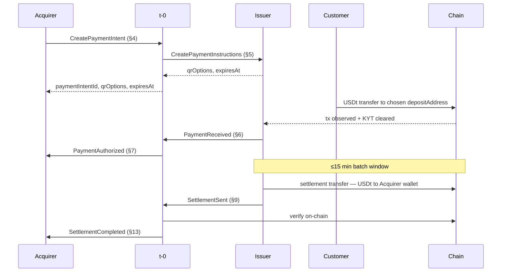
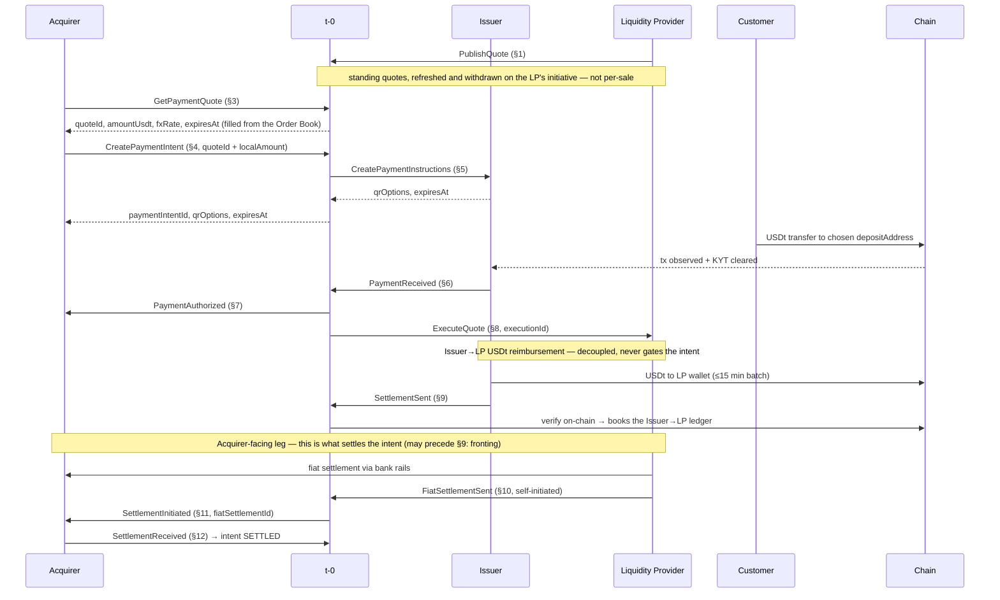

Business-level contract for the non-custodial QR payment flow. Transport details (REST, gRPC, mTLS, API keys) are not covered here.

> **Source of truth.** This file is the **single normative contract** — fields, rules, and decline codes. The generated [API Reference](/docs/integration-guidance/api-reference/) is a non-normative appendix derived from the proto. Where it disagrees with this file, this file wins.

> **Terminology.** Every identifier, message, state, and role maps to its industry-standard equivalent (ISO 20022 / ISO 8583 / EMVCo / on-chain), or is marked *local* where none exists.

## Participants

- **Acquirer** (e.g., Credibanco) — owns the merchant relationship; talks to the POS through its own internal API.
- **t-0 Network** — routes messages between the Acquirer and the Issuer, keeps the payment-intent ledger, maintains an **Order Book** of LP-pushed standing quotes (each Acquirer's quotes come from its single assigned LP) and answers USDt↔fiat quote requests from it, verifies settlement on-chain, and relays the Liquidity Provider's self-initiated fiat settlement to the Acquirer for confirmation when the Acquirer is configured for fiat settlement. Each Acquirer is mapped to exactly one Issuer at onboarding (and, for fiat settlement, to exactly one LP); t-0 routes `5` to that Issuer.
- **Issuer** (e.g., Rhino.fi) — creates payment instructions, watches the blockchain for the customer's payment, and settles in USDt on-chain. At onboarding the Issuer configures an `acquirerId → settlementWallet` mapping per Acquirer it serves; the wallet may belong to the Acquirer (USDt mode) or to that Acquirer's single LP (fiat mode — each Acquirer is served by exactly one LP, fixed at onboarding). The Issuer identifies the Acquirer from the `acquirerId` carried on `5 CreatePaymentInstructions` and uses this mapping to determine the `destinationAddress` for `9 SettlementSent`. This resolution is deliberately independent of any t-0 instruction, so t-0's on-chain destination check on `9` is a genuine cross-check, not a confirmation of its own input.
- **Liquidity Provider (LP)** — in fiat-settlement mode, receives the Issuer's USDt and, on its own initiative, settles the locked fiat amount with the Acquirer over bank rails, reporting it to t-0 through `10 FiatSettlementSent`. Each Acquirer is served by exactly one LP, fixed at onboarding; that LP feeds t-0's Order Book on its own initiative: it pushes standing quotes (`1 PublishQuote`) and may withdraw them (`2 WithdrawQuote`); each standing quote belongs to the LP that published it. The Acquirer's LP is fixed for all fiat-mode steps of every intent (`8`, the settlement wallet, `10`); a referenced quote (`4`) selects the rate and currency for that intent, not the LP. Currency coverage is **not** pre-checked at onboarding: a local-fiat currency is serviceable only while the LP has a standing quote for it. Because that LP is the sole source of the Acquirer's quotes, a currency it is not currently quoting is declined at `3` (`QUOTE_UNAVAILABLE`), and the LP's quote liveness gates all of the Acquirer's fiat sales — a deliberate MVP simplification with no fallback LP. In the fiat leg the LP is the Acquirer's payer — it pays over bank rails and knows the Acquirer as a payee, resolving its bank account from `acquirerId` — but not its obligor: the Issuer stays liable and the Acquirer reconciles against t-0, never the LP.

The settlement mode — USDt on-chain or fiat — is fixed per Acquirer at onboarding by the **Acquirer↔LP association** (an associated LP ⇒ fiat, none ⇒ USDt); the Issuer always settles in USDt either way. There are no direct messages between non-adjacent parties: the POS only talks to the Acquirer, the Acquirer only to t-0, and t-0 talks to the Issuer and to the LP. Responses and asynchronous events travel the same chain in reverse. The LP settles fiat with the Acquirer over bank rails — a real-world payout, not an API message; the Acquirer never talks to the LP directly.

## End-to-end flow

The customer payment and authorization mechanics are the same in both settlement modes. The diagrams duplicate those steps intentionally so each mode can be read independently.

### USDt settlement



### Fiat settlement via LP



In fiat mode there is **no `13`**: the Acquirer's own `12 SettlementReceived` is the terminal event. `13 SettlementCompleted` is sent only in USDt mode (see below).

If the QR expires before the customer pays, t-0 — the expiry authority — transitions the intent to `EXPIRED` at `expiresAt` on its own clock and sends `15` to the Acquirer; the Issuer's `14` confirms it released the deposit addresses.

Once `7 PaymentAuthorized` has fired, the Issuer has accepted the payment and is obligated to settle it. A chain reorg on the customer's payment, a rejected settlement batch, or a stuck reconciliation is an on-chain or operational matter for the Issuer to resolve — never a reversal for the Acquirer or the merchant. The Issuer's obligation is unchanged whether funds reach the Acquirer as USDt on-chain or as fiat through an LP; the LP delivers the fiat, but the Issuer — not the LP — remains the Acquirer's obligor.

When the Acquirer is configured for fiat settlement (e.g., COP), the USDt↔fiat rate comes from t-0's **Order Book of standing quotes**. Each LP pushes quotes into the book on its own initiative through `1 PublishQuote` — a locked `fxRate` with per-sale amount bounds and a validity window — refreshes its pricing by publishing new quotes alongside earlier ones, and may withdraw a quote through `2 WithdrawQuote`. Before a sale, the Acquirer obtains a quote through `3 GetPaymentQuote`; t-0 answers from the book with no per-sale LP interaction. A standing quote is **multi-consumable**: the same `quoteId` may be returned to any number of quote requests and referenced by any number of payment intents while the quote stands. The Acquirer passes the `quoteId` together with the sale's `localAmount` into `4 CreatePaymentIntent`; acceptance locks the quote's rate for that intent, and the headroom rule on `4` guarantees the quote outlives the intent's QR window.

Fiat settlement runs as **two independent legs**. In the normal order the Issuer settles the LP first and the LP then settles the Acquirer, but the contract ties the intent to the Acquirer-facing leg alone, so neither order is required:

- **Issuer→LP reimbursement leg — decoupled; it never gates the intent.** The Issuer only ever sends USDt: at settlement it sends USDt on-chain to the **LP's** wallet (not the Acquirer's) and reports it through `9 SettlementSent`, which t-0 verifies on-chain and **books as an Issuer→LP obligation in its ledger**, settling the Issuer's USDt to the LP for the executions it covers. This is independent of the Acquirer's intent: if `9` is delayed or never verifies, the **Issuer simply stays owing the LP** in the ledger — the intent is unaffected, and the LP carries the Issuer-default risk on any fiat it has already delivered. One `9` to the shared LP wallet may cover executions across **several Acquirers** that LP serves (see §9).
- **Acquirer-facing leg — this is what settles the intent.** The quote's validity (≈5 min) is shorter than the settlement batch cadence, so the moment the payment is authorized t-0 executes the quote with the LP through `8 ExecuteQuote`, minting a per-sale **`executionId`** — bound 1:1 to the intent inside t-0 — that binds the LP to the locked rate before the quote can expire. On the obligations it took at `8`, the LP settles the locked fiat to the Acquirer over bank rails on its own initiative and reports it through `10 FiatSettlementSent`. t-0 maps the LP's `settledExecutionIds` to their intents, mints a **`fiatSettlementId`**, and pre-notifies the Acquirer through `11 SettlementInitiated`, naming the `bankTransferRef` to expect and the intents it clears. Because the bank-rails leg is not on-chain-verifiable, t-0 treats the intent as **`SETTLED` only once the Acquirer confirms receipt** through `12 SettlementReceived` with the matching amount. The Acquirer's `12` is the **terminal** event — there is **no `13`** in fiat mode. Because this leg does not depend on `9`, the LP may also settle the Acquirer **before** the Issuer's USDt arrives (fronting it on the `8` obligations plus its private funding arrangement with the Issuer); the independence rule resolves that corner case cleanly.

## Payment intent states (t-0 ledger)

```
OPEN ──expiresAt reached (t-0 clock)──▶ EXPIRED                              (terminal)
       │
       6 accepted
       ▼
AUTHORIZED ──7 sent, USDt mode──▶ SETTLEMENT_PENDING ──9 verified──▶ SETTLED  (terminal)
AUTHORIZED ──7 sent, fiat mode──▶ AWAITING_FIAT ──────12 received──▶ SETTLED  (terminal)
```

The intent's lifecycle tracks **only the Acquirer-facing settlement**. In fiat mode the Issuer→LP `9 SettlementSent` is booked on a separate settlement record (the Issuer→LP reimbursement ledger) and **does not appear in this state machine** — it never moves the intent.

**OPEN** — intent created, payment instructions live, customer payment not yet observed.

**AUTHORIZED** — t-0 has accepted `6 PaymentReceived` and is transmitting `7 PaymentAuthorized`. On *transmit* of `7` (not on the Acquirer's acknowledgment, consistent with Obligation binding) the intent moves to `SETTLEMENT_PENDING` (USDt mode) or `AWAITING_FIAT` (fiat mode); in fiat mode t-0 also fires `8 ExecuteQuote` here.

**SETTLEMENT_PENDING** (USDt mode only) — t-0 is waiting for the Issuer's `9 SettlementSent` to the Acquirer's wallet. A verified `9` → `SETTLED`, then `13`.

**AWAITING_FIAT** (fiat mode only) — the LP owes the Acquirer fiat at the locked rate. t-0 awaits the LP's self-initiated `10 FiatSettlementSent`, relays it as `11 SettlementInitiated`, and closes the leg on the Acquirer's `12 SettlementReceived`. The intent → `SETTLED` when `12` arrives with the matching amount. The Issuer→LP `9` is independent and never enters here.

**SETTLED** — settlement reached the Acquirer (terminal). USDt mode: `9 SettlementSent` passed on-chain verification. Fiat mode: the Acquirer confirmed fiat receipt via `12` (the Issuer→LP `9` may still be outstanding — that is an Issuer↔LP ledger matter, not the intent's).

**EXPIRED** — reservation lapsed with no valid payment (terminal). Entered on t-0's clock at `expiresAt`; the Issuer's `14` is confirmation, not the trigger.

## Conventions

- **Data types used:** `string`, `number`, `amount` (decimal monetary), `timestamp` (absolute, UTC), `boolean`, `list of T`, `object { ... }`, `oneof { ... }` (tagged union — exactly one variant present; the variant key is the discriminator).
- **Amount derivation.** `amountUsdt` is derived only by t-0, at its single derivation point `4 CreatePaymentIntent` (and computed the same way as the indicative value on `3`): `amountUsdt = round(localAmount / fxRate, 2 dp, half-up)` — two decimal places, round-half-up. This holds in both settlement modes. The customer pays exactly this `amountUsdt`, and `6 PaymentReceived` requires strict equality against it.
- **Synchronous** endpoints return a response in the same call. **Asynchronous** endpoints are pushed events; the sender retries until the receiver acknowledges.
- **Idempotency** — every state-changing endpoint has a designated key; a repeat call with the same key returns the original result and causes no additional side effect. The lone exception is `3 GetPaymentQuote`, a stateless lookup with no idempotency key — it always returns the current standing quote.
- **Obligation binding** — all obligations in this protocol attach at the moment t-0 *transmits* the relevant message. LP or Issuer acknowledgment timing does not affect when an obligation is created or takes effect.
- **Retry identity** — a sender that believes a message was lost (no acknowledgment) **retries with the original key and identical content**; the receiver dedupes. A **rejection** is itself an acknowledgment, so the sender stops retrying — but a rejection **never consumes the key**: to fix the problem the sender **resubmits the same key with corrected fields**, which t-0 re-evaluates fresh. **Idempotent replay** — returning the original result with no new side effect — applies **only to an accepted call**; a rejected or declined call commits no result to replay. This is uniform across every keyed endpoint — `4` (`paymentRef`), `9` (`settlementRef`), `10`/`12` (`bankTransferRef`), `2` (`quoteId`). A genuinely *different* real-world action — a new on-chain settlement transaction, a second bank transfer — is a new event under its own new identifier, reconciled out of band; it is not a correction of the old key.
- **Idempotency scoping** — keys are scoped to the authenticated caller: `paymentRef` is unique per Acquirer; `settlementRef` is unique per Issuer; `quoteRef` and `bankTransferRef` are unique per LP. Because `bankTransferRef` is unique only per LP and the Acquirer does not mint it, `12` is keyed on the pair (`lpId`, `bankTransferRef`). t-0-minted keys (`paymentIntentId`, `quoteId`, `executionId`, `settlementId`, `fiatSettlementId`) are globally unique by construction.
- **Idempotency-key ownership** — every `t-0 → role` call is keyed on a t-0-minted id (`paymentIntentId`, `executionId`, `settlementId`, or `fiatSettlementId`); t-0 never uses one role's external id as the key in a message to another role.
- **Async rejection contract** — every inbound asynchronous endpoint (`6`, `9`, `10`, `12`, `14`) acknowledges with a `result` that is `oneof { accepted | rejected { rejectionCode, failing<Entity>Ids } }`. A rejection is a **terminal acknowledgment** for at-least-once purposes: the sender stops retrying and, per **Retry identity**, **resubmits the same key with corrected fields** — the rejection never consumes the key. Each endpoint's Rule lists its codes. Outbound `t-0 → role` async calls (`7`, `8`, `11`, `13`, `15`) carry no rejection — the receiver only acknowledges.
- **Decline model** — only the synchronous endpoints (`1`–`5`) can decline in the same call, and each synchronous response is a `result` that is `oneof { success { … } | failure { reason } }` — the `failure` variant carries a canonical `reason` code (mirroring the proto; there is no separate `declined` boolean). Before payment is received, the Acquirer learns of failure through the expiry event (`15 PaymentExpired`). After `7 PaymentAuthorized` has fired the Issuer has accepted the payment and is obligated to settle it; any on-chain retry or reconciliation the Issuer performs (directly in USDt, or via an LP in fiat mode) is not exposed to the Acquirer.
- **Chain names** are a fixed canonical set maintained by t-0 — full, **case-sensitive** names, identical across every endpoint carrying a `chain` field. (The proto `BLOCKCHAIN_*` enum labels and the SQL `pay_blockchain` labels are internal representations mapped to these wire names.) **Live at launch:** `TRON`, `Ethereum`, `BSC`. **Announced as upcoming, not yet accepted:** `Polygon`, `Arbitrum`, `Optimism`, `Base`, `Avalanche`, `Solana` — the Issuer offers no `qrOptions` on these, so a customer cannot pay on them through the flow until they go live. Extensible as the upcoming chains are enabled.

## Shared identifiers

| Identifier | Minted by | Notes |
|---|---|---|
| `quoteRef` | LP | Idempotency key on `1` — the LP's identifier for one pushed standing quote; echoed as data on `8 ExecuteQuote`. Unique per LP. |
| `quoteId` | t-0 | t-0's identifier for one standing quote in its Order Book, minted on `1`. Returned by `3`; referenced by any number of `4`s while the quote stands; carried as data on `8`. Also the key the LP echoes on `2 WithdrawQuote`. Fiat-configured Acquirers only. |
| `paymentRef` | Acquirer | Idempotency key on `4`. Unique per Acquirer. |
| `paymentIntentId` | t-0 | Idempotency key on `5`, `6`, `7`, `14`, `15`. Not exposed to the LP — see `executionId`. |
| `executionId` | t-0 | t-0's identifier for one execution of a standing quote — minted at authorization, bound 1:1 to the authorized payment intent. The LP's idempotency key on `8` and its obligation handle; the unit the LP reports settlements in (`settledExecutionIds` on `10`). Not exposed to the Acquirer. Fiat mode only. |
| `settlementRef` | Issuer | Idempotency key on `9`. The Issuer's id for its own USDt settlement. Unique per Issuer. |
| `settlementId` | t-0 | t-0's id for one **on-chain USDt settlement** (`9`), minted at the verified `9`. USDt mode: the Issuer→Acquirer settlement and the idempotency key on `13`. Fiat mode: the Issuer→LP reimbursement record, booked to the Issuer↔LP ledger and **not surfaced to the Acquirer**. |
| `fiatSettlementId` | t-0 | t-0's id for one **bank-rails fiat settlement** (`10`/`11`/`12`), minted when t-0 accepts the LP's `10` (the `fiat_settlement` record); the idempotency key on `11`. Fiat mode only. |
| `bankTransferRef` | LP | LP-generated reference on the bank-rails transfer and the idempotency key on the LP's self-initiated `10`. t-0 relays it as data on `11` so the Acquirer knows which transfer to expect; the Acquirer reads it off its statement and echoes it on `12`, where the idempotency key is the pair (`lpId`, `bankTransferRef`); t-0 matches `10` ↔ `12` on that pair. Unique per LP only — `lpId` disambiguates across LPs. Fiat mode only. |
| `acquirerId` | t-0 | t-0's stable identifier for the Acquirer. Included in `5` so the Issuer can resolve its `acquirerId → settlementWallet` mapping, and in `8` so the LP can resolve the Acquirer's registered bank destination. |
| `lpId` | t-0 | t-0's stable identifier for the Liquidity Provider. Carried as data on `11` so the Acquirer knows which LP's transfer to expect; echoed on `12`, where it scopes `bankTransferRef` (the key is the pair). Fiat mode only. |

`11 SettlementInitiated` (fiat mode) is keyed on t-0's `fiatSettlementId`; `13 SettlementCompleted` (USDt mode only) is keyed on t-0's `settlementId`. Neither uses a foreign role's id as its key — the `lpId` and `bankTransferRef` carried on `11` ride as data, not as the key. In USDt mode the Acquirer correlates the settlement through `13`'s `settledPaymentIntentIds` and `onChainTxHash`; in fiat mode through `11`'s `fiatSettlementId` + `bankTransferRef`, which it confirms with its own `12`.

Endpoint numbers below follow the end-to-end flow order; each section lists the endpoints exposed by that participant.

---

## Endpoints exposed by t-0 Network

## 1 `PublishQuote`

**t-0 ← LP** · synchronous · idempotency: `quoteRef`

The Liquidity Provider pushes one standing quote into t-0's Order Book: a rate at which it commits to receive USDt and deliver local fiat, with per-sale amount bounds (in USDt) and a validity window. A standing quote is immutable — the LP refreshes its pricing by publishing new quotes alongside earlier ones (publishing never discards an earlier quote) and removes one with `2 WithdrawQuote`. Fiat mode only.

### Request

- `quoteRef` — `string` — LP's identifier for this quote. A repeat call with the same value returns the original result unchanged.
- `localCurrency` — `string` — Currency the quote prices (e.g., `COP`).
- `fxRate` — `number` — Rate the LP commits to honor, in units of `localCurrency` per 1 USDt.
- `minAmountUsdt` — `amount` — Smallest single sale this quote may price, in USDt. Must be `≥ 0.01` (the 2-dp granularity of `amountUsdt`).
- `maxAmountUsdt` — `amount` — Largest single sale this quote may price, in USDt. Must be `≥ minAmountUsdt`.
- `expiresAt` — `timestamp` — Moment the quote stops standing, on t-0's clock.

### Response

`result` — `oneof` — exactly one variant:

- `success` — `object`:
  - `quoteId` — `number` — t-0's identifier for the standing quote; the id used everywhere downstream (`3`, `4`, `8`) and on the LP's own `2 WithdrawQuote`.
- `failure` — `object`:
  - `reason` — `string` — Canonical code — one of: `CURRENCY_UNSUPPORTED`, `LIMITS_INVALID`, `VALIDITY_INVALID`.

**Rule.** t-0 accepts the quote only when its bounds and validity are well-formed: it declines `LIMITS_INVALID` if `minAmountUsdt < 0.01` or `minAmountUsdt > maxAmountUsdt`, and `VALIDITY_INVALID` if `expiresAt` is at or before now, if the remaining validity is too short for any intent to clear the `4` headroom check (`expiresAt − now < max_reservation_window + processing_margin`, which would leave the quote unusable on every `4`), or if it exceeds the maximum validity window (≈1 h, configurable). While it stands — from acceptance until `expiresAt` on t-0's clock, or an earlier withdrawal — the quote is **multi-consumable**: it commits the LP to honor an execution (`8`) for every payment intent t-0 accepts against it, each within the per-sale USDt bounds, with no aggregate cap. The LP bounds its total exposure through the bounds, the validity window, and withdrawal. How t-0 ranks standing quotes when answering `3` is t-0-internal and out of scope of this document.

---

## 2 `WithdrawQuote`

**t-0 ← LP** · synchronous · idempotency: `quoteId`

The LP removes one of its standing quotes from the Order Book before its `expiresAt` — e.g., on a market move. Fiat mode only.

### Request

- `quoteId` — `number` — The standing quote to withdraw; must have been minted by a `1` from this LP. The key is a t-0-minted id the LP echoes and cannot re-mint, so a declined call does not consume it.

### Response

`result` — `oneof` — exactly one variant:

- `success` — `object` — empty; the withdrawal was accepted (or replayed as a no-op).
- `failure` — `object`:
  - `reason` — `string` — Canonical code — `QUOTE_UNKNOWN`.

**Rule.** Withdrawal takes effect when t-0 accepts the call: the quote stops being returned by `3` and stops accepting new intents on `4`. Intents accepted before the withdrawal are unaffected — their rate is locked and their executions (`8`) proceed. Withdrawing a quote that has already expired or was already withdrawn is acknowledged as a no-op (idempotent replay).

---

## 3 `GetPaymentQuote`

**t-0 ← Acquirer** · synchronous · no idempotency key (stateless lookup)

Returns a USDt↔fiat rate for an upcoming sale so a payment intent can be settled in fiat at a known amount. t-0 answers from its Order Book of standing LP quotes (`1`) — no per-sale LP interaction. Each call returns the current applicable standing quote — there is no idempotency replay; t-0 always answers with the freshest quote. Part of the contract for fiat-configured Acquirers only.

### Request

- `localCurrency` — `string` — Currency the merchant is quoting in (e.g., `COP`).
- `localAmount` — `amount` — Amount the merchant quoted in `localCurrency`. t-0 computes `amountUsdt = round(localAmount / fxRate, 2 dp, half-up)` for each candidate quote and selects one whose per-sale USDt bounds (`minAmountUsdt`–`maxAmountUsdt`) cover it.

### Response

`result` — `oneof` — exactly one variant:

- `success` — `object`:
  - `quoteId` — `number` — t-0's identifier of the **standing quote** that priced this request. Not consumed by use: the same `quoteId` may be returned to any number of quote requests and referenced by any number of payment intents while the quote stands.
  - `amountUsdt` — `amount` — USDt equivalent of `localAmount` at the quote's rate, `round(localAmount / fxRate, 2 dp, half-up)` — indicative for this request; the amount binding a sale is derived the same way at `4` from the `localAmount` passed there.
  - `fxRate` — `number` — The standing quote's rate, in units of `localCurrency` per 1 USDt.
  - `expiresAt` — `timestamp` — Moment the standing quote stops standing and can no longer be referenced; the LP may withdraw the quote earlier (`2`).
- `failure` — `object`:
  - `reason` — `string` — Canonical code — one of: `QUOTE_UNAVAILABLE` (no standing quote available for this currency — whether the LP is not quoting it right now or the Acquirer never enabled it), `AMOUNT_OUT_OF_RANGE` (a standing quote exists but none of their per-sale USDt bounds cover the request's `amountUsdt`).

**Rule.** The Acquirer must reference the quote on `4` while it stands. Referencing does not consume it — any number of intents may share one standing quote. The rate each sale settles at is the quote's `fxRate`, locked per intent when `4` is accepted; at authorization t-0 converts each paid intent into an LP execution at that rate (`8`), and the LP settles the resulting fiat amounts on the Issuer's behalf through bank rails (`10`).

---

## 4 `CreatePaymentIntent`

**t-0 ← Acquirer** · synchronous · idempotency: `paymentRef`

Creates a payment intent when the merchant starts a sale. t-0 calls `5` inline and returns what the POS needs to render a QR.

### Request

Always sent:

- `paymentRef` — `string` — Sale identifier the Acquirer already keeps in its own ledger. Calling again with the same value returns the original payment intent unchanged.

There is no per-sale settlement currency: the Issuer always settles in **USDt**. What the Acquirer ultimately receives is fixed at onboarding by the **Acquirer↔LP association** — an Acquirer with an associated LP is settled in fiat through it (in the quote's `localCurrency`), one without settles in USDt directly. That association selects which one of the two terms groups below is sent; t-0 declines a group inconsistent with it:

**Settling in USDt — the Issuer will pay the Acquirer on-chain.**

- `localCurrency` — `string` — Currency the merchant quoted the customer in (e.g., `COP`). Canonical amount for receipts, reports, and the Acquirer→merchant payout.
- `localAmount` — `amount` — Amount the merchant charged in `localCurrency`.
- `fxRate` — `number` — Units of `localCurrency` per 1 USDt, set by the Acquirer. t-0 derives `amountUsdt = round(localAmount / fxRate, 2 dp, half-up)` and stores it on the intent.

**Settling in fiat — the Acquirer is settled through a Liquidity Provider via bank rails.**

- `quoteId` — `number` — Identifier of a standing quote obtained from `3`, still standing. t-0 reads `localCurrency` and `fxRate` from the quote and derives `amountUsdt = round(localAmount / fxRate, 2 dp, half-up)`.
- `localAmount` — `amount` — Amount the merchant charged in the quote's `localCurrency`. Its `amountUsdt` must lie within the quote's per-sale USDt bounds.

### Response

`result` — `oneof` — exactly one variant:

- `success` — `object`:
  - `paymentIntentId` — `number` — t-0's identifier for this intent; carried on every later event.
  - `localCurrency` — `string` — Resolved value (echoed from the request in USDt mode; from the quote in fiat mode).
  - `localAmount` — `amount` — Resolved value.
  - `fxRate` — `number` — Resolved rate.
  - `amountUsdt` — `amount` — Exact amount the customer will pay in USDt (`= round(localAmount / fxRate, 2 dp, half-up)`).
  - `expiresAt` — `timestamp` — After this moment the Issuer releases the deposit addresses and the QR is no longer valid.
  - `qrOptions` — `list of objects` — One entry for each chain the Issuer supports for this intent; the customer picks one inside their wallet.
    - `chain` — `string` — Name of the chain (from the canonical set in Conventions).
    - `depositAddress` — `string` — One-time address reserved for this intent on that chain.
    - `renderablePayload` — `string` — URI the POS encodes as a QR image without any modification. The format is chain-native (EIP-681 on EVM chains, `tron:` URI on TRON, and so on); only the Issuer knows how to produce it.
- `failure` — `object`:
  - `reason` — `string` — Canonical code — one of: `ISSUER_UNAVAILABLE`, `ADDRESS_POOL_EMPTY`, `AMOUNT_OUT_OF_RANGE`, `QUOTE_EXPIRED`, `QUOTE_INSUFFICIENT_HEADROOM`.

**Rule.** In fiat mode, t-0 declines if the referenced quote no longer stands — past its `expiresAt` or withdrawn (`QUOTE_EXPIRED`) — if the intent's `amountUsdt` falls outside the quote's per-sale USDt bounds (`AMOUNT_OUT_OF_RANGE`), or if the remaining quote validity is too short to guarantee `8 ExecuteQuote` before the quote expires: `expiresAt − now < reservation_window + processing_margin` (`QUOTE_INSUFFICIENT_HEADROOM`). Acceptance locks the quote's rate for this intent — a later withdrawal or expiry of the quote does not affect intents already accepted against it. A decline here is the only way the Acquirer learns the intent failed before the customer even scans. No later "intent failed" event is sent. A `failure` does **not** consume the `paymentRef`: resubmitting the same `paymentRef` is re-evaluated from scratch (e.g., after the Acquirer fetches a fresh quote), so a previously declined sale can succeed on a later call; idempotent replay of the original `success` applies only once an intent was actually created.

---

## 6 `PaymentReceived`

**t-0 ← Issuer** · asynchronous · idempotency: `paymentIntentId`

The Issuer has seen the customer's payment on-chain and, per its own transaction-scoring policy, treats it as final. From this moment on the Issuer owns any on-chain risk for this payment.

### Request

- `paymentIntentId` — `number` — Intent this payment belongs to.
- `amountUsdt` — `amount` — Amount the Issuer credits against this intent. Always equals the intent's stored `amountUsdt` exactly — the 2-dp value t-0 derived at `4`, which is what the customer pays. If the customer sent a different amount, the Issuer refunds the received amount (minus on-chain transaction cost) to the sending wallet out of band and does not call `6`. If two payments arrive at the same deposit address and both have the correct amount, the Issuer credits one and refunds the second (minus transaction cost) out of band.
- `paymentMethod` — `oneof` — The payment instrument; the MVP's only variant is `usdtOnChain`. t-0 relays it to the Acquirer on `7` in both settlement modes.
  - `usdtOnChain` — `object` — Set for an on-chain USDt payment (the only MVP variant):
    - `chain` — `string` — Chain the customer used — one of the values originally returned in `qrOptions`.
    - `onChainTxHash` — `string` — Hash of the customer's USDt transfer.
    - `senderAddress` — `string` — Customer's source wallet address; suitable for the receipt and audit trail.
- `receivedAt` — `timestamp` — Moment the Issuer treated the payment as final.

**Rule.** KYT screening of the sender is complete before this call. A KYT failure is resolved by the Issuer out of band and never reaches t-0. t-0 must receive this call before the intent's `expiresAt`. t-0 validates `6` and, on failure, rejects with a `rejectionCode` (one of: `INTENT_EXPIRED` — received after `expiresAt` on t-0's clock, the cutoff being t-0's receipt time, not the Issuer's send time; `UNKNOWN_INTENT` — no such intent; `AMOUNT_MISMATCH` — `amountUsdt` is not exactly the intent's stored amount). t-0 enforces the amount equality itself rather than relying on the Issuer. A rejection is a terminal acknowledgment; on `INTENT_EXPIRED` the Issuer refunds the payment out of band to the customer, exactly as for a transfer that lands after expiry.

---

## 9 `SettlementSent`

**t-0 ← Issuer** · asynchronous · idempotency: `settlementRef`

The Issuer has sent USDt on-chain to the settlement destination for the listed payment intents. In **USDt mode** the destination is the Acquirer's registered wallet and this leg **is** the Acquirer's settlement. In **fiat mode** the destination is the **LP's** registered wallet: the leg **reimburses the LP** for fiat it fronts to the Acquirer (see `10`–`12`) and is **decoupled from the Acquirer's intent** — t-0 books it to the Issuer↔LP ledger and it never moves an intent's state. The Issuer always settles in USDt and never sends fiat. The settlement wallet and its chain are fixed at onboarding — per Acquirer in USDt mode, per LP in fiat mode — and are independent of whichever chain the customer paid on; cross-chain bridging, when required, is handled inside the Issuer.

### Request

- `settlementRef` — `string` — Issuer's identifier for this USDt settlement.
- `amountUsdt` — `amount` — USDt amount transferred.
- `onChainTxHash` — `string` — Hash of the settlement transaction.
- `chain` — `string` — Chain the settlement was sent on (from the canonical set in Conventions).
- `destinationAddress` — `string` — Registered settlement wallet on `chain` — the Acquirer's in USDt mode, the LP's in fiat mode.
- `settledPaymentIntentIds` — `list of number` — IDs of the intents this settlement clears. Per-intent amounts are not passed — t-0 reads them from its own ledger.
- `settledAt` — `timestamp` — Moment the Issuer completed the settlement transfer.

**Rule.** t-0 verifies every check before accepting: the on-chain transaction is confirmed and its amount equals `amountUsdt`; the settlement landed on the **registered (`chain`, `destinationAddress`) pair** for the Acquirer's mode — the Acquirer's wallet in USDt mode, the LP's wallet in fiat mode — where **both `chain` and address** must match (a right-address/wrong-chain transfer is rejected `WRONG_DESTINATION`); and `amountUsdt` equals the sum of the listed intents' stored amounts in t-0's ledger. Then, by mode:

- **USDt mode.** Every listed intent must currently be in `SETTLEMENT_PENDING`. On acceptance t-0 mints a `settlementId`, transitions the covered intents to `SETTLED`, and sends `13`.
- **Fiat mode.** The leg is the Issuer→LP reimbursement: the listed intents must already be authorized (normally in `AWAITING_FIAT`; or in `SETTLED` in the race where the LP settled the fiat and the Acquirer confirmed `12` before this reimbursement landed). On acceptance t-0 mints a `settlementId` and **books the reimbursement to the Issuer↔LP ledger**; it changes **no** intent state and sends **no** `13`. A single `9` to the LP wallet may cover intents across **several Acquirers** the LP serves; t-0 maps `settledPaymentIntentIds` to the LP's ledger position irrespective of Acquirer.

On rejection t-0 returns a `rejectionCode` (one of: `ON_CHAIN_UNCONFIRMED`, `AMOUNT_MISMATCH`, `WRONG_DESTINATION`, `INTENT_NOT_SETTLEABLE`) and `failingIntentIds`. The rejection does **not** consume the `settlementRef`: because the on-chain transfer already happened, the Issuer **resubmits the same `settlementRef` with corrected fields** (e.g., a corrected `settledPaymentIntentIds`). Only a genuinely different on-chain transfer is reported under a new `settlementRef`, reconciled out of band.

---

## 10 `FiatSettlementSent`

**t-0 ← LP** · asynchronous · idempotency: `bankTransferRef`

The Liquidity Provider has settled fiat to the Acquirer over bank rails for the listed executions and reports it on its own initiative. Fiat mode only. The LP acts on the firm obligations it accepted at `8 ExecuteQuote` plus its private funding arrangement with the Issuer — t-0 does not command it. This is the LP's own event; the intent is not settled until the Acquirer independently confirms receipt via `12`.

### Request

- `bankTransferRef` — `string` — Reference the LP used on the bank-rails transfer; unique per LP and the idempotency key for this event.
- `settledExecutionIds` — `list of number` — Executions this settlement clears, in the LP's execution-space (`8`). t-0 maps each to its payment intent.
- `localCurrency` — `string` — Currency delivered (e.g., `COP`). Matches the covered executions' `localCurrency`.
- `settlementAmount` — `amount` — Local-fiat amount delivered.
- `destinationAccount` — `string` — Acquirer's registered bank destination the fiat was sent to.
- `settledAt` — `timestamp` — Moment the LP completed the bank-rails transfer.

**Rule.** t-0 accepts the call only when every check against its own ledger passes: each entry in `settledExecutionIds` was created by an `8` to this LP and is not covered by a previously accepted `10`; **all covered executions resolve to a single Acquirer** (one bank transfer credits one account); `destinationAccount` matches that Acquirer's registered bank destination; `localCurrency` equals the covered executions' `localCurrency`; and `settlementAmount` equals the sum of the covered executions' `localAmount`. Otherwise t-0 rejects with a `rejectionCode` (one of: `EXECUTION_UNKNOWN`, `EXECUTION_ALREADY_COVERED`, `ACQUIRER_MIXED`, `CURRENCY_MISMATCH`, `AMOUNT_MISMATCH`, `DESTINATION_MISMATCH`) and `failingExecutionIds` — the LP's claimed amount is never accepted ahead of the obligations locked at `8`. A rejected `10` does **not** consume its `bankTransferRef` (the bank transfer already happened and the LP cannot re-mint it): the LP resubmits the same `bankTransferRef` with corrected `settledExecutionIds`/`settlementAmount`, and idempotent replay applies only to an accepted `10` — mirroring `12`. A genuine money discrepancy (e.g., a short transfer needing a top-up) is not a message correction: it is reconciled out of band between the LP and t-0, and any second transfer is reported under its own `bankTransferRef`. On acceptance t-0 maps `settledExecutionIds` to their payment intents and mints a **`fiatSettlementId`** for the resulting `fiat_settlement` record. Fiat settlement is not verified on-chain, so acceptance alone does not settle the intents: t-0 records the calling LP's `lpId` with `bankTransferRef` and `destinationAccount`, pre-notifies the Acquirer via `11 SettlementInitiated`, and waits for the Acquirer's `12 SettlementReceived` — the **sole** settlement oracle for the intent. The Issuer→LP `9` is **independent**: it reimburses the LP and is **not** a precondition for the intent reaching `SETTLED` (see §9, §12).

---

## 12 `SettlementReceived`

**t-0 ← Acquirer** · asynchronous · idempotency: (`lpId`, `bankTransferRef`)

The Acquirer confirms that fiat settlement actually landed in its bank account. Fiat mode only. This is the verification oracle for the bank-rails leg: t-0 cannot confirm a bank transfer on-chain, so the Acquirer — the only party that sees the funds arrive — closes the loop. The Acquirer reports what it observes on its statement plus the `lpId` t-0 named on `11`; t-0 correlates it to the LP's `10` and the covered intents.

### Request

- `lpId` — `number` — t-0's identifier for the LP that sent the transfer, echoed from `11`. Scopes `bankTransferRef`, which is unique only per LP.
- `bankTransferRef` — `string` — Reference on the received transfer, matched against the Acquirer's bank statement. With `lpId` it identifies the corresponding `10` record.
- `localCurrency` — `string` — Currency credited.
- `amountReceived` — `amount` — Amount credited to the Acquirer's account.
- `receivedAt` — `timestamp` — Moment the funds were credited.

**Rule.** t-0 verifies that the pair (`lpId`, `bankTransferRef`) matches exactly one `10` record (one `fiatSettlementId`) and that `amountReceived` equals the `settlementAmount` from that record — an amount the `10` validation already proved equal to the covered executions' locked obligations. If validation fails, t-0 rejects with a `rejectionCode` (one of: `AMOUNT_MISMATCH` — `amountReceived` ≠ the matched `10`'s `settlementAmount`; `UNKNOWN_TRANSFER` — no `10` matches the pair (`lpId`, `bankTransferRef`)) — the covered intents remain in `AWAITING_FIAT`. A rejected `12` does not consume its key: the Acquirer cannot mint a replacement `bankTransferRef`, so it resubmits the same (`lpId`, `bankTransferRef`) with corrected fields; idempotent replay applies only to an accepted `12`. On a matching call t-0 transitions the covered intents directly to `SETTLED` — the Acquirer's `12` is itself the terminal confirmation, so **no `13` is sent in fiat mode**, and the intent does **not** wait on the Issuer→LP `9` (that reimbursement is tracked independently; see §9). If no `12` arrives within a configured window after `11 SettlementInitiated`, t-0 escalates operationally to the Acquirer; the intents remain in `AWAITING_FIAT` and the obligation is never passed back to the Acquirer.

---

## 14 `PaymentExpired`

**t-0 ← Issuer** · asynchronous · idempotency: `paymentIntentId`

The Issuer confirms the reservation window ended with no valid payment and that it released the deposit addresses. Expiry itself is decided by t-0's clock, not by this event — see the Rule.

### Request

- `paymentIntentId` — `number` — Intent that expired.
- `expiredAt` — `timestamp` — Moment the Issuer released the deposit addresses.

**Rule.** Expiry is decided by t-0's clock, and only by it: when `expiresAt` passes with the intent still `OPEN`, t-0 transitions it to `EXPIRED` and sends `15` — it does not wait for `14`. `14` never changes intent state — whether the intent is already `EXPIRED` (the normal case) or in `AUTHORIZED`, `SETTLEMENT_PENDING`, `AWAITING_FIAT`, or `SETTLED`, t-0 acknowledges the call and takes no action — unless `paymentIntentId` is one t-0 never opened, in which case t-0 rejects with `UNKNOWN_INTENT`. A `6` received after `expiresAt` by t-0's clock is rejected — the cutoff is t-0's receipt time, not the Issuer's send time — and the Issuer refunds the payment out of band to the customer, exactly as it refunds an on-chain transfer that arrives after expiry.

---

## Endpoints exposed by Issuer

## 5 `CreatePaymentInstructions`

**Issuer ← t-0** · synchronous · idempotency: `paymentIntentId`

The Issuer creates one payment instruction option for each chain it supports for this intent and returns what the POS needs to render the QR.

### Request

- `paymentIntentId` — `number` — t-0's intent identifier. The Issuer stores it and includes it on every later callback.
- `acquirerId` — `number` — t-0's stable identifier for the Acquirer this intent belongs to. The Issuer stores it and uses it to resolve the `acquirerId → settlementWallet` mapping when it sends `9 SettlementSent`, keeping that destination resolution independent of any t-0 instruction.
- `amountUsdt` — `amount` — Amount the reserved addresses should accept.
- `expiresAt` — `timestamp` — Absolute moment t-0 requires the Issuer to hold the reservation until (t-0 sets a 60–120 second window in the MVP).

### Response

`result` — `oneof` — exactly one variant:

- `success` — `object`:
  - `qrOptions` — `list of objects` — One entry for each chain the Issuer supports for this intent.
    - `chain` — `string` — Name of the chain (from the canonical set in Conventions).
    - `depositAddress` — `string` — One-time address on that chain.
    - `renderablePayload` — `string` — Chain-native URI, ready for direct QR encoding.
  - `expiresAt` — `timestamp` — Absolute expiry of the reservation.
- `failure` — `object`:
  - `reason` — `string` — Canonical code — one of: `ISSUER_UNAVAILABLE`, `ADDRESS_POOL_EMPTY`, `AMOUNT_OUT_OF_RANGE`.

**Rule.** Only the Issuer produces `renderablePayload`; t-0 and the Acquirer pass it through unchanged. Adding a new chain therefore requires no change upstream.

**Expiry validation.** t-0's clock is authoritative for expiry. t-0 commands an absolute `expiresAt` (its `4`-acceptance time plus a 60–120 s window) and surfaces that to the Acquirer. It accepts the Issuer's returned `expiresAt` only if it is **at or after** the commanded value — a longer Issuer hold is harmless, since t-0 expires first on its own clock. A returned `expiresAt` **earlier** than the commanded value would release the deposit addresses while t-0 still treats the QR as live; t-0 discards such instructions and fails the parent `4` with `ISSUER_UNAVAILABLE`.

---

## Endpoints exposed by Acquirer

## 7 `PaymentAuthorized`

**Acquirer ← t-0** · asynchronous · idempotency: `paymentIntentId`

t-0 has accepted `6`. The Acquirer tells the merchant the sale is approved.

### Request

- `paymentIntentId` — `number` — Intent this authorization refers to.
- `paymentRef` — `string` — Echo of the value the Acquirer sent in `4`, so the Acquirer can match the event to the merchant order without another lookup.
- `localCurrency` — `string` — Echo of the intent.
- `localAmount` — `amount` — Echo of the intent.
- `fxRate` — `number` — Echo of the intent.
- `amountUsdt` — `amount` — Authorized amount.
- `paymentMethod` — `oneof` — The payment instrument, relayed from `6`. **Always sent, in both settlement modes**, so the Acquirer always knows the instrument and its metadata. The MVP's only variant is `usdtOnChain`.
  - `usdtOnChain` — `object` — Set for an on-chain USDt payment (the only MVP variant):
    - `chain` — `string` — Chain the customer used. In fiat-settlement mode the Acquirer does no chain handling — it is an opaque label for the receipt/audit trail only.
    - `onChainTxHash` — `string` — Hash of the customer's payment transaction; suitable for the merchant receipt. In fiat mode it is an opaque reference (no chain is resolved).
    - `senderAddress` — `string` — Customer's source wallet address, for the receipt and audit trail.
- `approvedAt` — `timestamp` — Moment t-0 accepted `6`.

---

## 11 `SettlementInitiated`

**Acquirer ← t-0** · asynchronous · idempotency: `fiatSettlementId`

Fiat mode only. When t-0 accepts the LP's self-initiated fiat settlement (`10`), it maps the covered executions to their payment intents, opens a `fiat_settlement` record, and tells the Acquirer which LP and bank transfer to expect and which intents it clears — before the Acquirer has seen the funds. The Acquirer matches `bankTransferRef` against its incoming statement and confirms with `12 SettlementReceived`.

### Request

- `fiatSettlementId` — `number` — t-0's id for this fiat settlement and the idempotency key for this event.
- `lpId` — `number` — t-0's stable identifier for the LP that sent the transfer; the Acquirer echoes it on `12` to scope `bankTransferRef`, which is unique only per LP.
- `bankTransferRef` — `string` — Reference the LP put on the bank-rails transfer; the Acquirer matches this against its statement and echoes it on `12`.
- `settledPaymentIntentIds` — `list of number` — Intents this settlement clears, resolved by t-0 from the LP's `settledExecutionIds`. The Acquirer maps them to its own `paymentRef`s.
- `localCurrency` — `string` — Currency the Acquirer will receive (e.g., `COP`).
- `settlementAmount` — `amount` — Local-fiat amount the LP reported sending.
- `initiatedAt` — `timestamp` — Moment t-0 recorded the LP's settlement and notified the Acquirer.

**Rule.** Informational pre-notice; it does not settle the intents. t-0 sends it on acceptance of the LP's `10`. The intents reach `SETTLED` when the Acquirer confirms the matching (`lpId`, `bankTransferRef`) via `12` with the correct amount — independent of the Issuer→LP `9`, which is a separate reimbursement (see §9). Delivered at least once; the Acquirer dedupes on `fiatSettlementId`.

---

## 13 `SettlementCompleted`

**Acquirer ← t-0** · asynchronous · idempotency: `settlementId`

**USDt mode only.** t-0 has verified on-chain that the Issuer's USDt settlement reached the Acquirer's registered wallet, and lists the payments it covers. In **fiat mode there is no `13`** — the Acquirer's own `12 SettlementReceived` is the terminal confirmation, since it already saw the funds land.

### Request

- `settlementId` — `number` — t-0's id for this settlement and the idempotency key for this event; the Acquirer dedupes on it.
- `settlementAmount` — `amount` — USDt amount the Acquirer received.
- `settledPaymentIntentIds` — `list of number` — IDs of the payment intents this settlement clears.
- `settledAt` — `timestamp` — Moment t-0 verified the settlement.
- `settlement` — `object` — The on-chain USDt settlement that reached the Acquirer:
  - `onChainTxHash` — `string` — Hash of the settlement transaction.
  - `chain` — `string` — Chain the Issuer used.
  - `destinationAddress` — `string` — Acquirer's registered wallet on `chain`.

---

## 15 `PaymentExpired`

**Acquirer ← t-0** · asynchronous · idempotency: `paymentIntentId`

The intent expired with no payment: t-0 sends this when `expiresAt` passes on its clock with the intent still `OPEN`, without waiting for the Issuer's `14`. The Acquirer clears the pending order and the POS drops the QR from the screen.

### Request

- `paymentIntentId` — `number` — Intent that expired.
- `paymentRef` — `string` — Echo of the value the Acquirer sent in `4`.
- `localCurrency` — `string` — Echo of the intent.
- `localAmount` — `amount` — Echo of the intent.
- `fxRate` — `number` — Echo of the intent.
- `expiredAt` — `timestamp` — Moment the intent became terminal.

---

## Endpoints exposed by the Liquidity Provider

## 8 `ExecuteQuote`

**LP ← t-0** · asynchronous · idempotency: `executionId`

At authorization (when t-0 accepts `6` and fires `7`), t-0 executes the standing quote for this now-paid intent, minting an **execution** — the LP-facing unit of obligation. Fiat mode only. This step exists because the quote's validity (≈5 min) is shorter than the settlement batch cadence (≤15 min): without it, the LP's rate commitment would lapse before settlement runs. Executing the quote converts the paid intent into a firm LP obligation that survives to the batch; a standing quote may be executed any number of times — one execution per authorized intent. The LP then settles the fiat to the Acquirer on its own initiative, on the obligation taken here, and reports it via `10 FiatSettlementSent`; the Issuer's reimbursement `9` is independent and never gates this, and the LP may even settle the Acquirer before `9` arrives (fronting it on the obligation taken here plus its private funding arrangement with the Issuer), which the independence rule resolves cleanly.

### Request

- `executionId` — `number` — t-0's identifier for this execution of the quote: the LP's idempotency key and its handle for this obligation. Bound 1:1 to the authorized payment intent inside t-0; the intent itself is never exposed to the LP.
- `quoteId` — `number` — t-0's id for the standing quote this execution is under; carried as data (t-0's id-space).
- `quoteRef` — `string` — The LP's own identifier for that standing quote (the `quoteRef` it minted on `1`), echoed so the LP can attribute the execution to its native quote record without a `quoteId` lookup.
- `acquirerId` — `number` — t-0's stable identifier for the Acquirer. The LP uses this to resolve the Acquirer's registered bank destination from its onboarding configuration.
- `localCurrency` — `string` — Currency to deliver (e.g., `COP`).
- `localAmount` — `amount` — Fiat amount owed to the Acquirer for this sale.
- `fxRate` — `number` — The standing quote's rate, locked for this sale at intent acceptance.
- `amountUsdt` — `amount` — USDt the LP will receive at settlement for this sale.
- `executedAt` — `timestamp` — Moment t-0 executed the quote.

**Rule.** t-0 sends `8` per intent, at authorization. The headroom check on `4` guarantees the quote's validity covers this moment; if the LP withdrew the quote after the intent was accepted, the execution still proceeds at the locked rate. The LP's obligation attaches at the moment t-0 transmits this message, independent of acknowledgment timing. `8` is non-repudiable: the LP pre-committed by publishing the standing quote, t-0 sends the authoritative `localAmount` and `amountUsdt`, and the LP only acknowledges — there is no decline or dispute on `8`, and the LP computes no amounts of its own. The LP holds the rate and is obligated to settle the fiat to the Acquirer on its own initiative, independent of later market movement and of when the Issuer's `9` reimbursement arrives. Delivered at least once; the LP dedupes on `executionId`.

---

## Reliability rules

- **At-least-once delivery** on asynchronous endpoints (`6`, `7`, `8`, `9`, `10`, `11`, `12`, `13`, `14`, `15`). The sender retries with backoff until the receiver acknowledges. See Obligation binding and Retry identity in Conventions.
- **t-0 is the source of truth** for intent state and for on-chain settlement verification. The Acquirer and the Issuer reconcile against t-0.
- **Reconciliation timers** — t-0 applies separate, mode-specific escalation timers (exact thresholds are contractual parameters, not fixed here):
  - *USDt mode* — if an intent remains in `SETTLEMENT_PENDING` beyond threshold T₁ (its `9` not yet verified), t-0 escalates to the Issuer.
  - *Fiat mode — bank-rails leg* — if the LP's `10 FiatSettlementSent` has not been received within T₂ of **authorization** (the intent sits in `AWAITING_FIAT`), t-0 escalates to the LP.
  - *Fiat mode — confirmation leg* — if `12` has not been received within T₃ of `11 SettlementInitiated` being sent, t-0 escalates to the Acquirer.
  - *Fiat mode — Issuer→LP reimbursement (ledger)* — if the Issuer's `9` to the LP wallet has not verified within T₄ of authorization, t-0 escalates to the **Issuer**. This is an Issuer↔LP ledger matter; it never affects the Acquirer's intent, which settles on `12` regardless.
  The Issuer is the responsible party for every unsettled obligation. The obligation to settle is never passed back to the Acquirer.

## Out of scope (MVP)

Refunds, chargebacks, disputes, manual cancel/void, mispayment events (the Issuer's refund obligation for incorrect-amount payments is in scope per `6`), card channel, onboarding endpoints, query/status/report endpoints, bilateral credit-line management, Acquirer→merchant payout, the LP's internal pricing and risk mechanics and bank-rail mechanics, Acquirer-side quote amendment or cancellation (standing quotes are immutable; the LP refreshes by publishing new quotes and may withdraw — `1`, `2`), and the POS↔Acquirer API.
